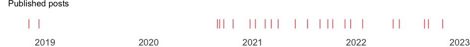

<!-- README.md is generated from README.Rmd. Please edit that file -->

# About

A personal website:

⚒️ created with the [distill](https://rstudio.github.io/distill/)
package in R,

💡 continuously inspired by community contributed tips at the
[distillery](https://jhelvy.github.io/distillery/) and all content
creators out there,

🗨️ with commenting by [giscus](https://giscus.app/), and

🚀 deployed through Netlify.

# Some stats ⚠️ WIP

🎉 Piping Hot Data has **24** posts since **2018-11-05**\!

📅 That’s a post roughly every **34** days, or about 0.8 posts per month,
since 2020-08-30.

✍️ The last post was published **18** days ago ([Regular, intentional,
and time-boxed yak
shaving.](https://www.pipinghotdata.com/posts/2022-11-02-regular-intentional-and-time-boxed-yak-shaving)).
As Yihui Xie advises, I try to write like no one is reading. But your
feedback does help motivate me to keep writing. 😉

<!-- -->

📂 Click to expand a full list of posts

| Date       | Title                                                                                                                                                                                             |
| :--------- | :------------------------------------------------------------------------------------------------------------------------------------------------------------------------------------------------ |
| 2022-11-02 | [Regular, intentional, and time-boxed yak shaving.](https://www.pipinghotdata.com/posts/2022-11-02-regular-intentional-and-time-boxed-yak-shaving)                                                |
| 2022-09-13 | [The case for variable labels in R](https://www.pipinghotdata.com/posts/2022-09-13-the-case-for-variable-labels-in-r)                                                                             |
| 2022-08-30 | [My 4 Biggest Internship Takeaways](https://www.pipinghotdata.com/posts/2022-08-30-my-4-biggest-internship-takeaways)                                                                             |
| 2022-06-02 | [Locating R and R Adjacent Software and Configuration Files](https://www.pipinghotdata.com/posts/2022-06-02-locating-r-and-r-adjacent-software-and-configuration-files)                           |
| 2022-05-12 | [Code line highlighting in Quarto revealjs presentations](https://www.pipinghotdata.com/posts/2022-05-12-code-line-highlighting-in-quarto-revealjs-presentations)                                 |
| 2022-01-24 | [Report Ready PDF tables with rmarkdown, knitr, kableExtra, and LaTeX](https://www.pipinghotdata.com/posts/2022-01-24-report-ready-pdf-tables-with-rmarkdown-knitr-kableextra-and-latex)          |
| 2021-12-13 | [Modifying the GitHub repo containing my Distill website](https://www.pipinghotdata.com/posts/2021-12-13-modifying-the-github-repo-containing-my-distill-website)                                 |
| 2021-11-23 | [Getting started with unit testing in R](https://www.pipinghotdata.com/posts/2021-11-23-getting-started-with-unit-testing-in-r)                                                                   |
| 2021-10-11 | [Estimating correlations adjusted for group membership](https://www.pipinghotdata.com/posts/2021-10-11-estimating-correlations-adjusted-for-group-membership)                                     |
| 2021-09-23 | \[Curating for @WeAreRLadies on Twitter\](<https://www.pipinghotdata.com/posts/2021-09-23-curating-for-wearerladies-on-twitter>)                                                                  |
| 2021-08-27 | [A tidyverse pivot approach to data preparation in R](https://www.pipinghotdata.com/posts/2021-08-27-a-tidyverse-pivot-approach-to-data-preparation-in-r)                                         |
| 2021-07-14 | [Polished summary tables in R with gtsummary](https://www.pipinghotdata.com/posts/2021-07-14-polished-summary-tables-in-r-with-gtsummary)                                                         |
| 2021-06-01 | [Custom interactive sunbursts with ggplot in R](https://www.pipinghotdata.com/posts/2021-06-01-custom-interactive-sunbursts-with-ggplot-in-r)                                                     |
| 2021-04-01 | [Deploy previews with Netlifly](https://www.pipinghotdata.com/posts/2021-04-01-deploy-previews-with-netlifly)                                                                                     |
| 2021-03-08 | [R-Ladies styled code gifs with xaringan and flipbookr](https://www.pipinghotdata.com/posts/2021-03-08-r-ladies-styled-code-gifs-with-xaringan-and-flipbookr)                                     |
| 2021-02-15 | [GGanimating a geographic introduction](https://www.pipinghotdata.com/posts/2021-02-15-gganimating-a-geographic-introduction)                                                                     |
| 2021-01-11 | [From gmailr to the Google Books API](https://www.pipinghotdata.com/posts/2021-01-11-from-gmailr-to-the-google-books-api)                                                                         |
| 2020-12-23 | [Leveraging labelled data in R](https://www.pipinghotdata.com/posts/2020-12-23-leveraging-labelled-data-in-r)                                                                                     |
| 2020-10-25 | [Your first R package in 1 hour](https://www.pipinghotdata.com/posts/2020-10-25-your-first-r-package-in-1-hour)                                                                                   |
| 2020-09-22 | [Exporting editable ggplot graphics to PowerPoint with officer and purrr](https://www.pipinghotdata.com/posts/2020-09-22-exporting-editable-ggplot-graphics-to-powerpoint-with-officer-and-purrr) |
| 2020-09-07 | [Introducing RStudio and R Markdown](https://www.pipinghotdata.com/posts/2020-09-07-introducing-the-rstudio-ide-and-r-markdown)                                                                   |
| 2020-08-30 | [A job interview presentation inspired by the R community](https://www.pipinghotdata.com/posts/2020-08-30-a-job-interview-presentation-inspired-by-the-r-community)                               |
| 2018-12-11 | [Stringr 4 ways](https://www.pipinghotdata.com/posts/2018-12-11-stringr-4-ways)                                                                                                                   |
| 2018-11-05 | [Welcome to Piping Hot Data](https://www.pipinghotdata.com/posts/2018-11-05-welcome-to-piping-hot-data)                                                                                           |

-----

*The automatically rendered readme was inspired by [Matt
Dray](https://www.rostrum.blog/2021/04/14/gha-readme/); giscus
commenting was motivated by [Joel
Nitta](https://www.joelnitta.com/posts/2021-11-24_using-giscus/).*

*Updated 2022-11-20 05:29:49*
