```{r setup, include=FALSE}
knitr::opts_chunk$set(echo = FALSE)
```

# TL; DR

The RStudio IDE has some wonderful features!  Here are some tips and tricks for new learneRs to get started with regards to [customizing the IDE](#ide), [getting started with R Markdown](#rmd), and a bit of [troubleshooting](#error). 

# Background

Gif's were captured in May 2019, likely with RStudio version 1.2.1335-1.  Keyboard shortcuts are for Windows users, Mac users may differ.  For Windows users, I also recommend changing your default settings to [show file extensions](https://support.winzip.com/hc/en-us/articles/115011457948-How-to-configure-Windows-to-show-file-extensions-and-hidden-files){target="_blank"}.  

And if you are not familiar with it, please allow me [introduce](#end) you to Will Smith's 1998 hit "Gettin' Jiggy Wit It."  `r emo::ji("musical_note")`_Na na na na na na na nana_ `r emo::ji("musical_note")`

# Customizing the IDE {#ide}


### Adjusting panels


### Re-arrange panels

`Tools -> Global Options -> Panel Layout`

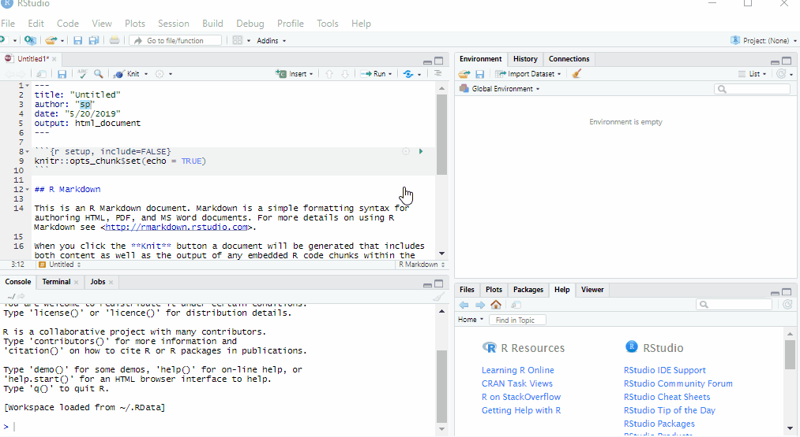


### Recover lost panels


### Font size/resolution

`View -> Zoom in / Zoom out / Actual size`


### Personalization

`Tools -> Global Options -> Appearance`


### Margin column

`Tools -> Global Options -> Code -> Display -> Show margin -> Margin column 80`

Consider placing a margin column at 80 characters as a reminder for code formatting.  Keeping code within 80 characters can make it easier to read when switching displays or sharing code.

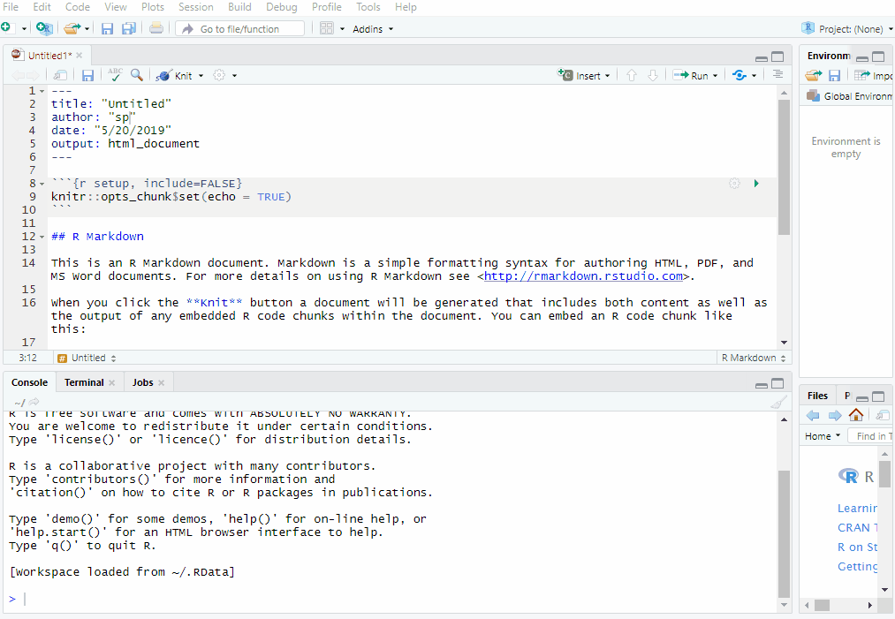


# R Markdown {#rmd}

### Opening a new R Markdown

`File -> New file -> R Markdown`  &nbsp;&nbsp; or &nbsp;&nbsp; {width=5%} `-> R Markdown`

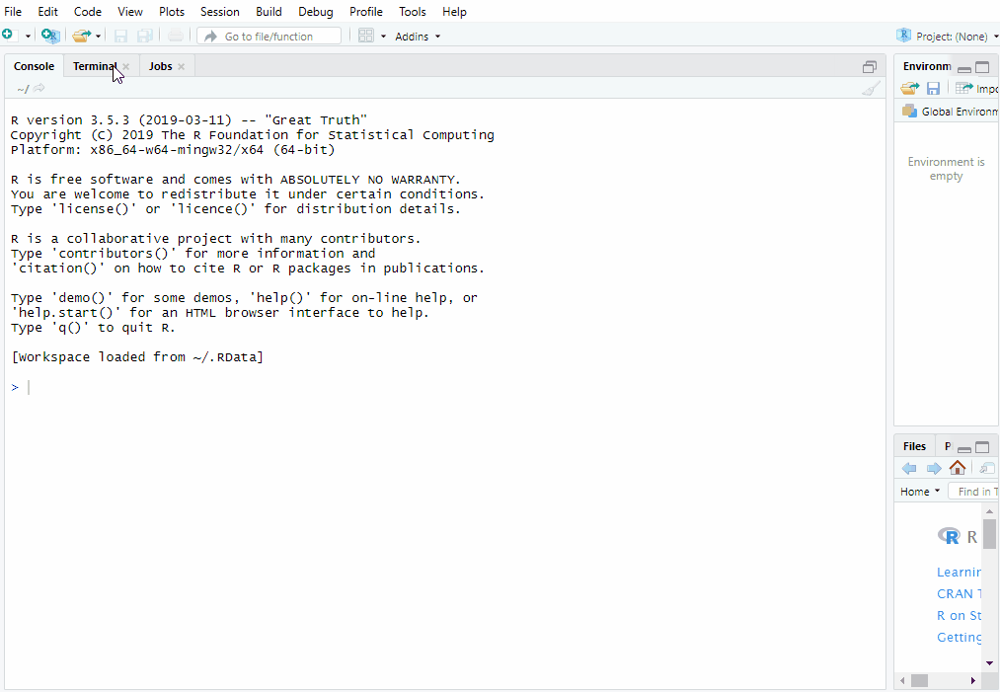

### Knitting an R Markdown


### Preview an R Markdown


### Personalizing R Markdown

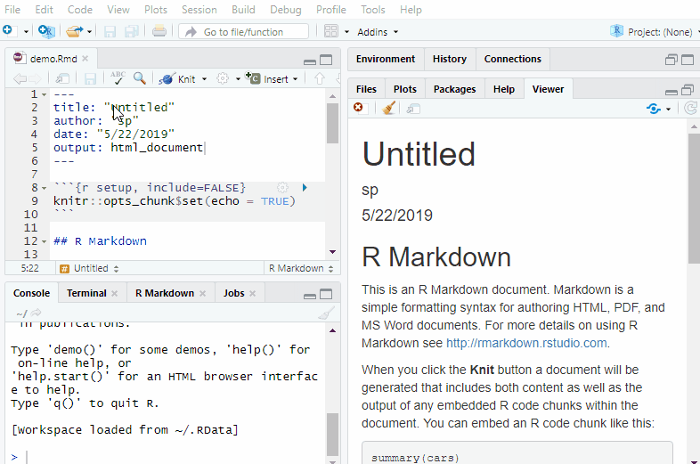

### Inserting/splitting code chunks

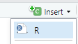{width=10%} &nbsp;&nbsp; or &nbsp;&nbsp; `Ctrl + Alt + I`


### Chunk anatomy

{width=75%}

### Chunk names

Chunk names allow you to quickly navigate code, automatically name figures, and troubleshoot errors. Chunk names must be **unique**! If no name is provided, a default numbered chunk name will be assigned.

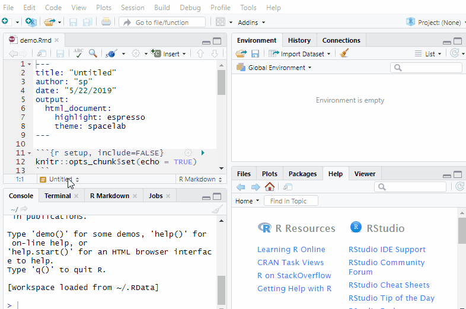

### Chunk execution

{width=10%} &nbsp;&nbsp; or &nbsp;&nbsp; `Ctrl + Enter`

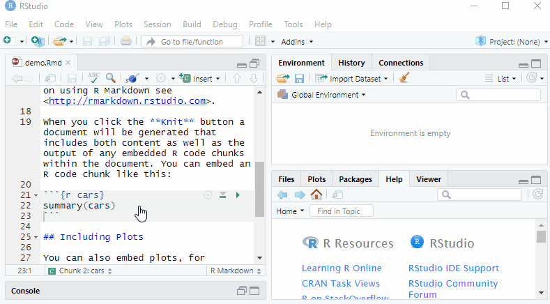

### Chunk options

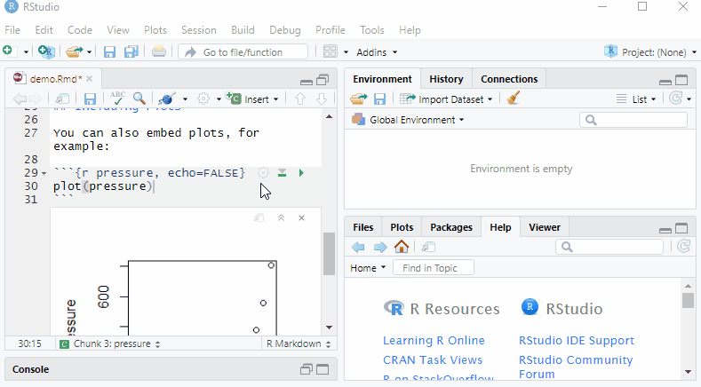


# R Markdown Troubleshooting {#error}

### YAML error


### Chunk error

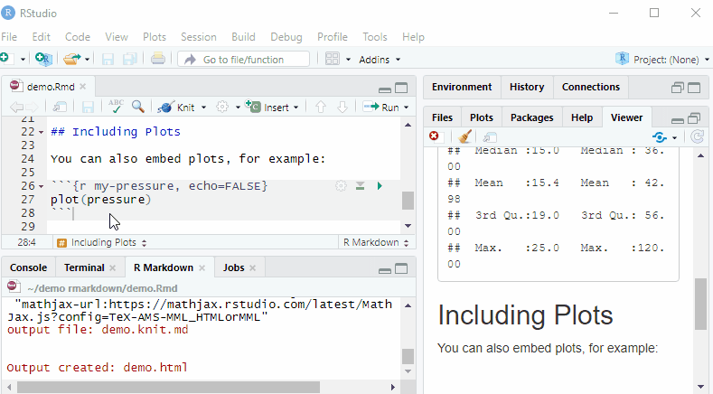

### Chunk error for duplicate chunk name

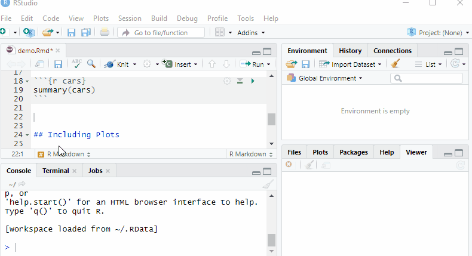

### Layout error

Let your markdown **breathe**! If something doesn't look right, try adding white space.

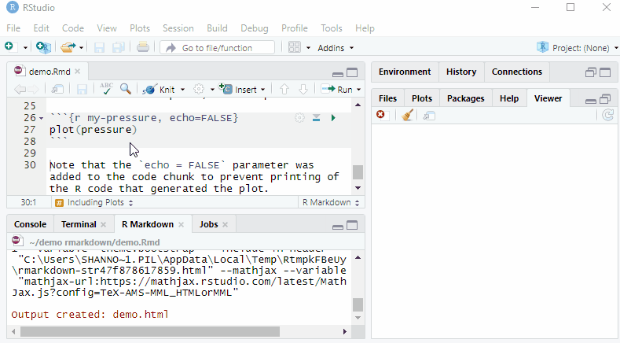


### R code error

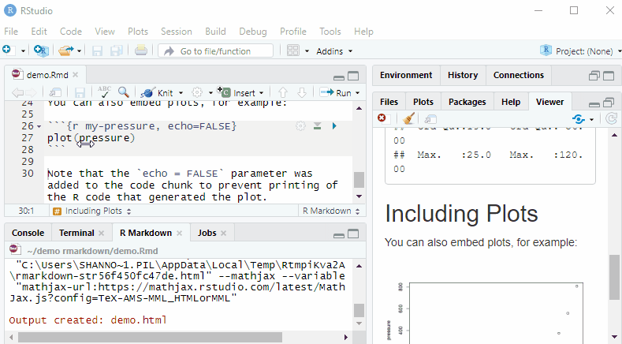


# The end{#end}

<iframe width="560" height="315" src="https://www.youtube.com/embed/3JcmQONgXJM" frameborder="0" allow="accelerometer; autoplay; encrypted-media; gyroscope; picture-in-picture" allowfullscreen></iframe>

# Acknowledgments

Thumbnail artwork adapted from [`@allison_horst`](https://twitter.com/allison_horst?lang=en).