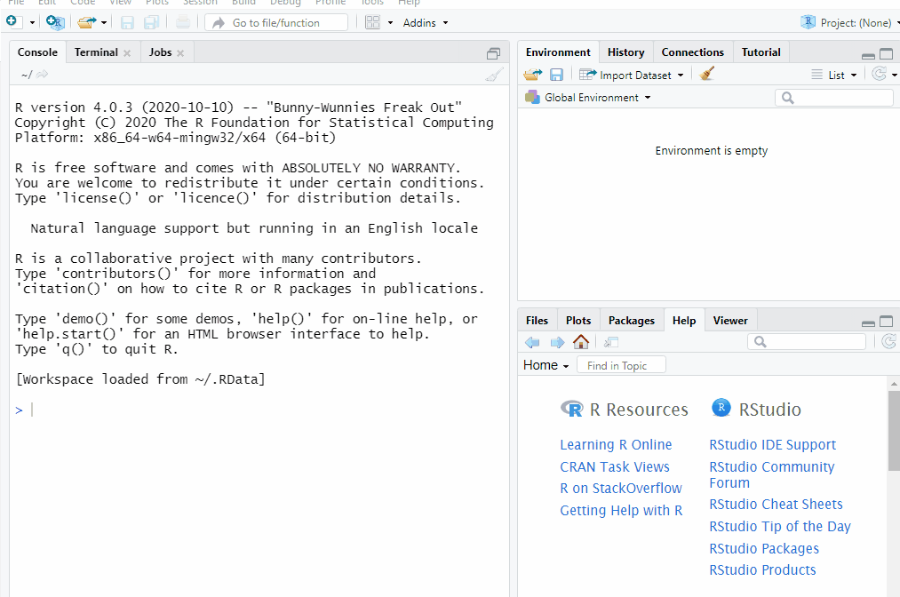

```{r setup, include=FALSE}
knitr::opts_chunk$set(echo = TRUE)
```

# TL; DR

This blog post accompanies the [R-Ladies Philly](https://www.rladiesphilly.org/){target="_blank"} [workshop](https://www.meetup.com/rladies-philly/events/268783126/){target="_blank"} on November 12, 2020.  We demonstrate how leveraging the  [devtools](https://github.com/r-lib/devtools){target="_blank"} and [usethis](https://usethis.r-lib.org/){target="_blank"} packages in package development can automate folder structure and file creation, speeding up the development process.  

<aside>
This post will be updated with the YouTube workshop recording link when it is available.
</aside>

# Abstract

This workshop is for people looking to learn how to make their own R packages and learn how to use `usethis` and `devtools` for package development. The workshop will cover handy one time functions (i.e., `usethis::create_package`) as well as functions used continuously throughout package development (i.e., `devtools::document`). At the end of the hour you should have a working, well-documented package with a single function, as well as a better understanding of the files and file structure required for R packages.

This workshop is suitable for beginner to intermediate R users. Attendees should be familiar with functions, but will not be writing their own function in this workshop. Familiarity with pipe or tidyverse is helpful.

# Disclaimer


<aside>
Artwork adapted from [`@allison_horst`](https://twitter.com/allison_horst?lang=en){target="_blank"}.
</aside>

I have learned enough about package development to share with you what has worked
well for me; however, I am still learning!  Comments and suggestions are welcome.

# Getting started

This material was developed using:

| Software / package  | Version               |
|---------------------|-----------------------|
| R                   | 4.0.3                 | 
| RStudio             | 1.3.1073              | 
| `devtools`          | 2.3.2                 | 
| `usethis`           | 1.6.3                 |
| `tidyverse`         | 1.3.0                 |
| `rlang`             | 0.4.8                 |
| `broom`             | 0.7.1                 |

Please install and update all software / packages prior to following along, as otherwise errors may arise.

# Tool kit

Single usage functions only need to be used one time in the development process;
multiple usage functions are executed as needed. This table only contains functions
used in this workshop; there are many other handy functions in [devtools](https://github.com/r-lib/devtools){target="_blank"} and [usethis](https://usethis.r-lib.org/){target="_blank"} for package development.


| Usage    | Function                                       | Purpose                           |
|----------|------------------------------------------------|-----------------------------------|
| Single   | `usethis::create_package("path/package")`      | initialize package                | 
|          | `usethis::use_mit_license("Your name")`        | add  license                      |
|          | `usethis::use_pipe()`                          | add pipe function as a dependency |
| Multiple | `devtools::check()`                            | build package locally and check   |
|          | `devtools::load_all()`                         | load functions in `r emo::ji("folder")` `R/` into memory    |
|          | `usethis::use_r("function")`                   | create R script for function      |
|          | `usethis::use_package("package")     `         | add package dependency            |
|          | `devtools::document()`                         | build and add documentation       |

Other resources:

* [Package development](https://rawgit.com/rstudio/cheatsheets/master/package-development.pdf){target="_blank"} cheat sheet

* [R packages](https://r-pkgs.org/){target="_blank"} book by Hadley Wickham and Jenny Bryan

* [How to develop good R packages](https://masalmon.eu/2017/12/11/goodrpackages/){target="_blank"} by Maëlle Salmon

* [R Package Primer](https://kbroman.org/pkg_primer/){target="_blank"} by Karl Broman

# First package

Open an R session and submit the following, modified to your desired location.  Here,
I am creating a package named `ralph` on my desktop. (This name is inspired by **R**-**L**adies **Ph**illy.) 

```{r create-package, eval=FALSE}
usethis::create_package("C:/Users/Shannon.Pileggi/Desktop/ralph")
```



Now you have a package!  The `usethis::create_package` function:

1. Creates a new R project named `ralph` at your specified location.

2. Opens the `ralph` project in a new RStudio session.

3. Creates the minimal essential files and structure required for R packages. 

<aside>
See the [package development](https://rawgit.com/rstudio/cheatsheets/master/package-development.pdf){target="_blank"} cheat sheet for a picture overview of the full file structure. 
</aside>

_Optional:_ 

If you are already authenticated, the `usethis` package has some handy functions to quickly connect your local package to a GitHub repository, 

```{r, eval=FALSE}
usethis::use_git()     # step 1 ----
usethis::use_github()  # step 2 ----
```

<aside>
GitHub is [renaming](https://github.com/github/renaming){target="_blank"} the default branch from `master` to `main`. Currently, `usethis::use_github()` creates a repo with the default branch named `master`.  
</aside>

For more references on using git / GitHub, see Jenny Bryan's [Happy Git and GitHub for the useR](https://happygitwithr.com/){target="_blank"} or [Ch 18](https://r-pkgs.org/git.html){target="_blank"} in R Packages by Hadley Wickham and Jenny Bryan.  


# First check

Now that we have a package, let's check it.  Submitting [`devtools::check()`](https://r-pkgs.org/r-cmd-check.html){target="_blank"} updates package documentation, builds the package, and submits over 50 checks for metadata, structure, R code, documentation, and more! 

```{r check-package-1, eval=FALSE}
devtools::check()
```

This can take a while to run, depending on how big your package is.  It
is helpful to run frequently, especially if you are planning
on submitting to CRAN.  But even for internal packages, it is still
good practice.  

Our first check results in a single warning - that our package needs a license in the 
`DESCRIPTION` file:


To fix this, add the [license](https://r-pkgs.org/description.html#description-license){target="_blank"} of your choice.  A standard recommendation is the MIT license due to broad permissions.  

```{r use-license, eval=FALSE}
usethis::use_mit_license("Shannon Pileggi")
```

This updates the description file, as well as creates two new license files in your project that you never have to touch.


<aside>
The `DESCRITPION` file automatically populates with some fields from your [`.Rprofile`](https://usethis.r-lib.org/articles/articles/usethis-setup.html#store-default-values-for-description-fields-and-other-preferences-1){target="_blank"}, which can be modified with `usethis::edit_r_profile()`.
</aside>


You can go back and complete the remaining [DESCRIPTION](https://r-pkgs.org/description.html){target="_blank"} fields later.  Re-submit 

```{r check-package-2, eval=FALSE}
devtools::check()
```

and our package is error, warning, and note free.


# First function

### Create

The `compute_corr` function is a wrapper for `cor.test` that produces tidy output for Pearson's correlation estimate (along with a p-value) to quantify the linear relationship between two quantitative variables.

```{r define-function, eval = TRUE}
compute_corr <- function(data, var1, var2){
  
    # compute correlation ----
    cor.test(
      x = data %>% dplyr::pull({{var1}}),
      y = data %>% dplyr::pull({{var2}})
    ) %>% 
    # tidy up results ----
    broom::tidy() %>% 
    # retain and rename relevant bits ----
    dplyr::select(
      correlation = estimate, 
      pval = p.value
    )
  
}
```

<aside>
This function uses [tidy evaluation](https://dplyr.tidyverse.org/articles/programming.html#introduction-1){target="_blank"} by embracing (`{{`) unquoted variable names.
</aside>

Let's add the `compute_corr` function to `ralph`.

```{r create-function, eval=FALSE}
usethis::use_r("compute_corr")
```

This creates a blank R script named `compute_corr.R` located in the `R/` folder.  It is convention that your function name and R script name are the same.  Copy and paste the function to the blank R script, and then save.


### Execute

Take your function for a [test drive](https://r-pkgs.org/workflows101.html#load-all){target="_blank"} with `devtools::load_all` ("arguably the most important part of the devtools workflow").

```{r, eval = FALSE}
devtools::load_all()
```

This places your function in local memory so that you may tinker and confirm its 
execution.  Let's give it a try.


```{r include=FALSE}
library(tidyverse)
```


```{r}
compute_corr(data = faithful, var1 = eruptions, var2 = waiting)
```

<aside>
Depending on which packages are loaded in your R session, you
may have a small hiccup here, which we discuss in the workshop.
</aside>

### Document

Next [document](https://r-pkgs.org/man.html){target="_blank"} the `compute_corr` function using the Roxygen skeleton. First, place your cursor in the function definition, and then you can add the skeleton two ways:

1. `Code -> Insert Roxygen Skeleton`, or 

2. `Cntrl + Alt + Shift + R`

You should see this:


where we now have an outline to fill in.  Note that the three arguments
in our function (`data`, `var1`, `var2`) were automatically detected.  Update the documentation as follows:


```{r, eval = FALSE}
#' Computes a tidy correlation
#'
#' @param data input data set
#' @param var1 name of variable 1 
#' @param var2 name of variable 2 
#'
#' @return A tibble with the Pearson correlation and the p-value
#' @export
#'
#' @examples
#' compute_corr(data = faithful, var1 = eruptions, var2 = waiting)
```

Save your function and submit:

```{r document-function, eval = FALSE}
devtools::document()
```

This did a lot of work for you!


1. The `man` folder (short for `manual`) now contains a file called `compute_corr.Rd`.  This is the documentation for your function; you never edit this manually.

2. The `NAMESPACE` now specifies that the package will export the `compute_corr` function.  

Preview the documentation with:

```{r preview-documentation, eval = FALSE}
?compute_corr
```


If you want to modify your documentation, make the changes in the Roxygen skeleton in `compute_corr.R`, save, and then resubmit `devtools::document()`.


### Check

Now submit 

```{r, eval=FALSE}
devtools::check()
```

and you'll see that we have some concerns.


This is because `compute_corr` depends on functions from other packages, such as:

1. The pipe function (`%>%`) from the `magrittr` package.

2. The `tidy` function from the `broom` package.

3. The `select` function from the `dplyr` package.

4. The `pull` function from the `dplyr` package.

<aside>
Are any other functions missing from this list?
</aside>

### Dependencies

We can fix these errors, warnings, and  notes by specifying the dependencies in the `compute_corr` function.  

**1. Package dependencies**

To specify a [package dependency](https://r-pkgs.org/description.html#dependencies){target="_blank"}, the name of the package needs to be listed in the `DESCRIPTION` file.  This can be automatically done for you by submitting

```{r, eval = F}
usethis::use_package("broom")
usethis::use_package("dplyr")
```
 


**2. Functions within packages**

There are three ways you can specify required [functions within packages](https://r-pkgs.org/namespace.html#import-r){target="_blank"}.  

1. Use the `::` notation within your function, as in `broom::tidy` (recommended, used in this post).

2. In the Roxygen section of your function, use `@importFrom pkg fun1 fun2` - if you prefer this over using `::`.

3. In the Roxygen section of your function, `@import pkg` - imports all functions from a package; use sparingly/wisely as this makes your package bulkier.

**Special case** 

The pipe function (`%>%`) from the `magrittr` package is a special case. The easiest way to include the pipe is

```{r, eval = F}
usethis::use_pipe()  # step 1 ----
devtools::document() # step 2 ----
```

Here, step 1 creates `utils-pipe.R` in your `R` folder and adds `magrittr` to imports in the `DESCRIPTION` file; step 2 adds the pipe to your `NAMESPACE` file.


Now let's run the check again:

```{r, eval = F}
devtools::check()
```

Can you diagnose the note(s) this time? What steps would you take to correct it?  I'm saving this for discussion in the 
workshop.^[In the `compute_corr` function we failed to specify that the `cor.test` function is from the `stats` package (which is [loaded by default](https://cran.r-project.org/doc/manuals/r-release/R-admin.html#Default-packages){target="_blank"} on start up). 
Update the `compute_corr` function with `stats::cor.test`, and then `devtools::check()` again. The notes regarding _no visible binding..._ remain; solve with the [.data pronoun](https://dplyr.tidyverse.org/articles/programming.html#how-tos-1){target="_blank"}. (1) Add `rlang` to your `DESCRIPTION` file with `usethis::use_package("rlang")`. (2) Include `#' @importFrom rlang .data` in the Roxygen section of your function documentation. (3) In the `compute_corr` function, replace `estimate ` with `.data$estimate` and `p.value` with `.data$p.value`. The link to the error, warning, and note free `ralph` package on github will be updated here after the workshop.] 


# Installing your package

Open a new R session.  Install your package from your local directory or GitHub, load your package, and execute your functions. 

```{r, eval = F}
# install package from local directory ----
devtools::install("C:/Users/Shannon.Pileggi/Desktop/ralph")

# or install package from GitHub ----
# devtools::install_github("shannonpileggi/ralph")
```


<aside>
Due to [GitHub renaming](https://github.com/github/renaming){target="_blank"} the default branch from `master` to `main`, you may need to fiddle with the
`ref` argument in `devtools::install_github`.
</aside>

```{r, eval = F}
# load package ----
library(ralph)
```


```{r, eval = TRUE}
# execute function ----
compute_corr(data = faithful, var1 = eruptions, var2 = waiting)
```


# Summary 

I hope you feel empowered to start developing your own packages now! We went 
through many of these steps one time only; however, in the development process,
some of these steps are iterative. Here is a recap of our steps, although
your work flow may differ. 

| Step                                    | How                                          |
|-----------------------------------------|----------------------------------------------|
|  1. Load development packages.          | `library(usethis)`, `library(devtools)`      | 
|  2. Create new package.                 | `usethis::create_package("path/package")`    |
|  3. _Optional:_ Connect to GitHub repo. | `usethis::use_git()`, `usethis::use_github()`|
|  4. Check build.                        | `devtools::check()`                          | 
|  5. Add license.                        | `usethis::use_mit_license("Your name")`      |
|  6. Check build.                        | `devtools::check()`                          |
|  7. Create new function.                | `usethis::use_r("function")`                 |
|  8. Test drive function.                | `devtools::load_all()`                       |
|  9. Insert Roxygen skeleton.            | `Menu -> Code -> Insert Roxygen Skeleton`    |
| 10. Document package.                   | `devtools::document()`                       |
| 11. Check build.                        | `devtools::check()`                          |
| 12. Specify package dependencies.       | `usethis::use_package("package")`            |
| 13. Specify functions within packages.  | `package::function`                          |
| 14. Document package.                   | `devtools::document()`                       |
| 15. Check build.                        | `devtools::check()`                          |
| 16. Install package.                    | `devtools::install("path/package")`, or      |
|                                         | `devtools::install_github("user/repo")`      |


<aside>
Although not explicitly written in these steps, I also recommend [restarting R frequently](https://rstats.wtf/save-source.html#restart-r-often-during-development){target="_blank"} in the development process
(`Session -> Restart R` or `Ctrl + Shift + F10`) in order to test your package in a clean environment.
</aside>

# Acknowledgements

Thank you [R-Ladies Philly](https://www.rladiesphilly.org/){target="_blank"} for hosting this workshop! [Chun Su](https://learniningwithsckinta.netlify.app/){target="_blank"} kindly created the thumbnail image for this workshop, as well as provided feedback on this post and the workshop content (thank you for so generously sharing your time!). On [R-Ladies slack](https://rladies-community-slack.herokuapp.com/){target="_blank"}, [Mayra Valdés](https://twitter.com/mayrop){target="_blank"} exchanged some ideas with me regarding different ways to write the `compute_corr` function and [Jenny Bryan](https://twitter.com/JennyBryan){target="_blank"} helped me better understand where [`{{`](https://dplyr.tidyverse.org/articles/programming.html#indirection-2){target="_blank"} lives and how it works.  I learned much of this content from attending the rstudio::conf2020 [Building Tidy Tools workshop](https://github.com/rstudio-conf-2020/build-tidy-tools){target="_blank"} co-instructed by [Charlotte Wickham](https://twitter.com/CVWickham){target="_blank"} and [Hadley Wickham](https://twitter.com/hadleywickham){target="_blank"}.  Shout out to Hillary Parker for showing us all [how to build packages from scratch in 2014](https://hilaryparker.com/2014/04/29/writing-an-r-package-from-scratch/){target="_blank"}.