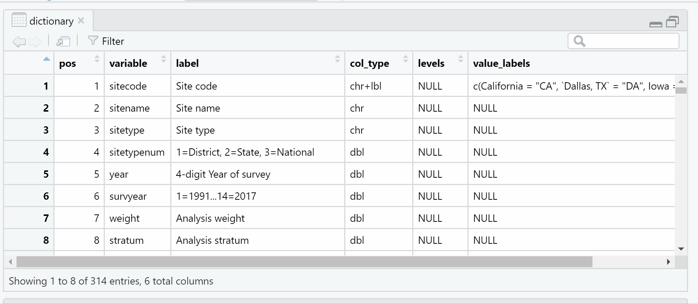
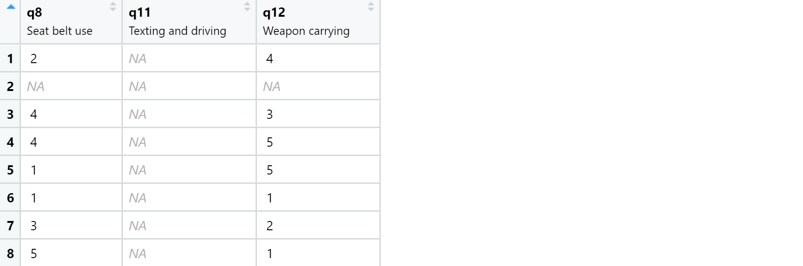

```{r setup, include=FALSE}
knitr::opts_chunk$set(echo = TRUE)
```

```{r, echo=FALSE, out.width = "100%", fig.cap="Artwork adapted from  [`@allison_horst`](https://twitter.com/allison_horst?lang=en).", fig.alt="Cute monster pointing to string banner with hex symbols for the labelled, haven, and sjlabelled pacakges."}
knitr::include_graphics("labelled_preview.png")
```


# Last updated

This post was last updated on `r Sys.Date()` to reflect package updates.


# TL; DR

The [`haven`](https://haven.tidyverse.org/){target="_blank"}, [`labelled`](https://larmarange.github.io/labelled/){target="_blank"}, and [`sjlabelled`](https://strengejacke.github.io/sjlabelled/articles/labelleddata.html){target="_blank"} packages can be used to effectively work
with SPSS, SAS, and Stata data sets in R through implementation of the `haven_labelled` class, which stores variable and value labels. Here are my most used functions for getting started with labelled data:


| Purpose                                          | Function                             | 
|--------------------------------------------------|--------------------------------------|
| 1. Import SPSS labelled data                     | `haven::read_sav()`                  | 
| 2. Create data dictionary                        | `labelled::generate_dictionary()`    | 
| 3. Identify if variable is `haven_labelled`      | `haven::is.labelled()`               | 
| 4. Convert `haven_labelled` variables to numeric | `base::as.numeric()`                 |
| 5. Convert `haven_labelled` variables to factors | `haven::as_factor()`                 |
| 6. Convert variable label to variable name       | `sjlabelled::label_to_colnames()`    |

# Introduction 

Labelled data traditionally, though not exclusively, arises in survey data. SAS, SPSS, and Stata have established infrastructures for labelled data, which consists of metadata in the form of  variable and value labels. This post is for R users who already have a SPSS (`.sav`), SAS (`.sas7bdat`), or Stata (`.dta`) data file and want to incorporate the labelled data features into their R workflow. With R’s `haven`, `labelled`, and `sjlabelled` packages, you can leverage the inherent data labelling structure in these data sets to work interactively with variable and value labels, making it easier to navigate data while also allowing the user to convert metadata to data. This post discusses general characteristics of labelled data and practical tips for data analysis with labelled data.  

<aside>
I work exclusively with SPSS (`.sav`) data files, and so I have not evaluated this process on SAS (`.sas7bdat`) or Stata (`.dta`) data files. `r emo::ji("crossed fingers")` everything works the same!
</aside>

# YRBSS labelled data

The Youth Risk Behavior Surveillance System (YRBSS) is a publicly available data set from the Centers for Disease Control and Prevention (CDC) that "monitors health-related behaviors that contribute to the leading causes of death and disability among youth and adults." On Aug 9, 2020, I downloaded YRBSS materials from the [CDC website](https://www.cdc.gov/healthyyouth/data/yrbs/data.htm){target="_blank"}. This site has both the the 2017 national data (`sadc_2017_national.dat`) and the SPSS syntax to convert the `.dat` file to an SPSS labelled data file (`2017_sadc_spss_input_program.sps`). I do have an SPSS license, and I used the SPSS syntax to convert the `.dat` file to an SPSS labelled data file (`sadc_2017_national.sav`). As the `.sav` data file is not available on the CDC site, you can download the `.sav` data from my [github repo](https://github.com/shannonpileggi/pipinghotdata_distill/tree/master/_posts/2020-12-23-leveraging-labelled-data-in-r/data){target="_blank"}.

# Getting started 

This material was developed using:

| Software / package  | Version               |
|---------------------|-----------------------|
| R                   | 4.0.5                 | 
| RStudio             | 1.4.1103              | 
| `tidyverse`         | 1.3.1                 |
| `here`              | 0.1                   |
| `haven`             | 2.3.1                 |
| `labelled`          | 2.8.0                 |
| `sjlabelled`        | 1.1.7                 |


```{r}
library(tidyverse)  # general use ----
library(here)       # file paths  ----
library(haven)      # import .sav files ----  
library(labelled)   # tools for labelled data ----
library(sjlabelled) # more tools for labelled data ----
```


# Importing labelled data

I use the [`haven`](https://haven.tidyverse.org/){target="_blank"} package to import SPSS (`.sav`) data files.  

```{r}
# import data ----
dat_raw <- haven::read_sav(here::here( "_posts", "2020-12-23-leveraging-labelled-data-in-r", "data", "sadc_2017_national.sav"))
```

Variables in a data set have a `class`, which consists of assignments like `numeric`, `character`, and `factor`, among others. When labelled features are present, the `haven` package assigns a class of `haven_labelled`. This is important to know as many packages you work with may not have methods for `haven_labelled` objects.

When I first started working with SPSS data files, I also explored the [foreign](https://cran.r-project.org/web/packages/foreign/index.html){target="_blank"} package, which preceeds `haven`.
Using `foreign` takes a bit longer than `haven`, can result in truncation of long character variables, and produces a different labelled data structure compared to `haven`. I have a strong preference for the `haven` package. 


# Creating a data dictionary

A data dictionary contains metadata about your data. The `labelled::generate_dictionary` function
can be used to create a data dictionary, extracted straight from your data. The usefulness
of the data dictionary depends on the quality of your metadata.  

```{r}
# create data dictionary ----
dictionary <- labelled::generate_dictionary(dat_raw)
```

The result is a data frame in my R environment with the number of observations equal to number of variables in the original data set.  I can interactively explore the `dictionary` in R to quickly find variables or documentation of interest.  For example, I can find all variables related to "weapons" with a search.

```{r, echo=FALSE, out.width = "100%", fig.cap="Gif demonstrating search feature in data viewer utilized to find variables with the word `weapon` in the data dictionary.", fig.alt="5 variables containing the word weapon in the label appear, 2 of which are haven labelled class and 3 of which are numeric."}

```


# Identifying labelled features

Standard data consists of variables (e.g., country) and values (e.g. US, UK, CA). When
working with labelled data, variables and values each have two features. Variables consist
of a name and a label; values consist of a code and a label. For example, here are the 
features of the `q8` variable.

| Feature        | Assignment    |
|----------------|---------------|
| Variable name  | q8            |
| Variable label | Seat belt use |
| Value codes    | 1, 2, 3, 4, 5 |
| Value labels   | Never, Rarely, Sometimes, Most of the time, Always |

You can see this information in the data dictionary - here is a snippet of the dictionary
for three variables. The `value_labels` field combines the value codes and value labels.

```{r}
dictionary %>% 
  dplyr::filter(variable %in% c("q8", "q11", "q12")) %>% 
  dplyr::select(variable, label, value_labels) 
```


To dive a bit deeper, you can see the `class` of the `q8` variable:

```{r}
dat_raw %>% 
  dplyr::pull(q8) %>% 
  class(.)
```

and how the metadata of `q8` is stored.  

```{r}
dat_raw %>% 
  dplyr::select(q8) %>% 
  str(.)
```

You don't need to get into the weeds of this to work effectively with labelled data, but knowing
this can help troubleshoot errors. 

# Viewing labelled features

Beyond the dictionary, labelled features can also be seen when working with your data interactively. The console simultaneously prints value codes and labels side by side, 
with the code first followed by the label in brackets.

```{r}
dat_raw %>% 
  dplyr::select(q8, q11, q12) 
```

Sometimes the alignment throws me a bit when I am reading this as the value codes and labels are left aligned, which places the value codes associated with `q12` closer to `q11`.

When viewing the data frame in RStudio, the data frame displays the variable label under the variable name; however, only value codes (and not value labels) are displayed.

```{r, echo=FALSE, fig.cap="Screenshot showing how haven labelled data appear in the viewer pane, with variable labels under the variable name, and value codes (not value labels) displayed.", fig.alt="Screenshot provided for variables q8, q11, and q12."}

```

# Common operations

I primarily use three packages for working with labelled data: [`haven`](https://haven.tidyverse.org/){target="_blank"}, [`labelled`](https://larmarange.github.io/labelled/){target="_blank"}, and [`sjlabelled`](https://strengejacke.github.io/sjlabelled/articles/labelleddata.html){target="_blank"}. These three packages do have some overlap in functionality, in addition to naming schemes that differ but achieve the same objective (e.g., `haven::as_factor` vs `sjlabelled::as_label`), or naming schemes that are the same but achieve different objectives (e.g., `haven::as_factor` vs `sjlabelled::as_factor`). `r emo::ji("grimace")` To compound confusion, the concept of a _label_ can refer to either variable or value labels. Frequently, plural function names refer to value labels, as in `haven::zap_labels` or `labelled::remove_val_labels`. 

Here are operations I commonly perform on labelled data:

1. Evaluate if variable is of class `haven_labelled`.

   + _Why?_  Troubleshooting, exploring, mutating.

   + _Function(s):_ `haven::is.labelled()`

2. Convert `haven_labelled` variable to `numeric` value codes.

   + _Why?_  To treat the variable as continuous for analysis. For example, if a 1-7 rating scale imports as labelled and you want to compute a mean.

   + _Function(s):_ `base::as.numeric()` (strips variable of all metadata), `haven::zap_labels()` and `labelled::remove_val_labels` (removes value labels, retains other metadata) 

3. Convert `haven_labelled()` variable to `factor` with value labels.

   + _Why?_ To treat the variable as categorical for analysis.

   + _Function(s):_ `haven::as_factor()`, `labelled::to_factor()`, `sjlabelled::as_label()`.  As far as I can tell, these three functions have the same result. By default, the factor levels are ordered by value codes. 

4. Convert variable label to variable name.

   + _Why?_ For more informative or readable variable names.

   + _Function(s):_ `sjlabelled::label_to_colnames()`


# Example

For this example, I reduce the data set to 2017 records only and select three variables related
to carrying weapons and safety, all of which are measured on the same scale.

```{r}
# retain info on weapons and safety for 2017 ----
dat_2017 <- dat_raw %>% 
  dplyr::filter(year == 2017) %>% 
  dplyr::select(record, q12, q13, q15) 

```

```{r}
# preview data ----
dat_2017
```

This code produces a bar plot showing the frequencies of the three variables from data as imported, displaying variable names and value codes.

```{r bar-plot-1, fig.cap="Bar plot 1 displays variable names and value codes"}
# bar plot 1 ----
dat_2017 %>% 
   pivot_longer(
    cols = -1,
    names_to = "variable",
    values_to = "days"
  ) %>% 
  count(variable, days) %>% 
  # include factor(days) to correctly show value codes in ggplot ----
  ggplot(aes(x = n, y = factor(days))) +
  facet_wrap(. ~ variable) +
  geom_col() 
```

Now I add two lines of code to implement two changes - convert the variables to factors and convert the variable labels to variable names. This plot displays variable labels and value labels, producing a more informative figure.

```{r bar-plot-2, fig.cap="Bar plot 2 displays variable labels and value labels"}
# bar plot 2 ----
dat_2017 %>% 
  # --------------------------------------------------------------
  # change 1: convert haven_labelled variables to factors ----
  mutate_if(haven::is.labelled, haven::as_factor) %>% 
  # change 2: convert variable labels to variable names ----
  sjlabelled::label_to_colnames() %>% 
  # --------------------------------------------------------------
  pivot_longer(
    cols = -1,
    names_to = "variable",
    values_to = "days"
  ) %>% 
  count(variable, days) %>% 
  # unnecessary to include factor(days) here as was already converted in change 1 ----
  ggplot(aes(x = n, y = days)) +
  facet_wrap(. ~ variable) +
  geom_col() 
```


# Other packages and `haven_labelled` objects 

It is probably safe to assume that most packages you work with don't know how to 
handle the `haven_labelled` class - if the package does produce a result, it is likely
making an educated guess which may not be in line with your needs.

For example, in using `ggplot` for Figure \@ref(fig:bar-plot-1) above, I included the line `y = factor(days)`; if instead I had `y = days` in Figure \@ref(fig:bar-plot-1), `ggplot` yields the following message: 

> Don't know how to automatically pick scale for object of type haven_labelled/vctrs_vctr/double. Defaulting to continuous.

Treating the `days` variable as continuous resulted in an uninformative plot (not shown), which
was corrected by converting the variable to `factor`.

What about other packages I use? In [`skimr`](https://github.com/ropensci/skimr){target="_blank"} 2.1.3 `haven_labelled` inputs result in value codes treated as numeric values. In [`gtsummary`](http://www.danieldsjoberg.com/gtsummary/){target="_blank"} 1.4.0 `haven_labelled` variables are omitted from output as it is not an accepted input; however, a helpful message is printed in the console recommending to update your variable type. In general, you will probably find a mix of messages, warnings, errors, omissions, or guessing  when using `haven_labelled` variables with other packages. These issues can be resolved by converting the `haven_labelled` variables to `numeric` or `factor`, depending on the context.

<aside>
Note updated `r Sys.Date()`: Although `gtsummary` does not currently support value labels, it does support variable labels! See [this tweet](https://twitter.com/WeAreRLadies/status/1363186751133667330?s=20){target="_blank"} for a quick demo, and the [Polished summary tables in R with gtsummary](https://www.pipinghotdata.com/posts/2021-07-14-polished-summary-tables-in-r-with-gtsummary/){target="_blank"} blog post for more information. 
</aside>


# Workflow for labelled data manipulation

When converting `haven_labelled` objects to `factor` or `numeric`, be intentional about
where the conversion happens in your workflow. The [Introduction to labelled](https://cran.r-project.org/web/packages/labelled/vignettes/intro_labelled.html){target="_blank"} vignette
by Joseph Larmarange outlines two different approaches:

1. First convert `haven_labelled` variables; second perform data manipulation utilizing variable labels (if factor).

2. First perform data manipulation utilizing variable codes; second convert `haven_labelled` variables.  

For me this question usually distills down to: for data manipulation, are the value codes or the value labels easier to work with? Sometimes the brevity of the value code helps (i.e., `q12 == 1`), whereas other times the context of the value label makes the code more readable (i.e., `q12 == "0 days"`). Note that the placement of the conversion can have downstream effects on your code. 

# Summary

The `haven`, `labelled`, `sjlabelled` packages create new structures and work flows for labelled data that allow you to harness the power of R while still honoring the valuable metadata framework that exists in SPSS, SAS, and Stata data sets. The functions discussed in this post cover most of my daily needs with labelled data; if you want to do more, next steps might include handling specific types of coded missing data or creating labelled data within R.

# Acknowledgments

Thanks to [Daniel Sjoberg](http://www.danieldsjoberg.com/){target="_blank"} for the gentle nudge to update this post. `r emo::ji("hug")`

```{r include=FALSE}
knitr::knit_exit()
```

```{r}
check <- dat_raw %>% 
  mutate(
    f1 = haven::as_factor(q8),
    f2 = labelled::to_factor(q8),
    f3 = sjlabelled::as_label(q8),
    f4 = sjlabelled::as_factor(q8),
    n1 = base::as.numeric(q8),
    n2 = sjlabelled::as_numeric(q8),
    n3 = haven::zap_labels(q8),
    n4 = labelled::remove_val_labels(q8)
  ) %>% 
  dplyr::select(q8, f1, f2, f3, f4, n1, n2, n3, n4)
```

