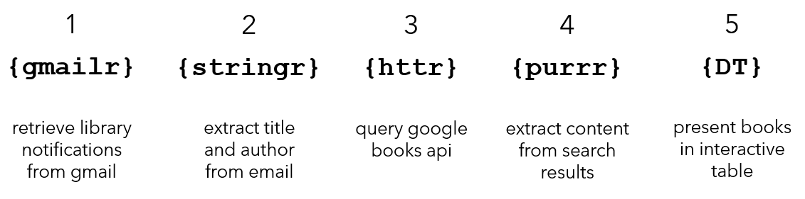
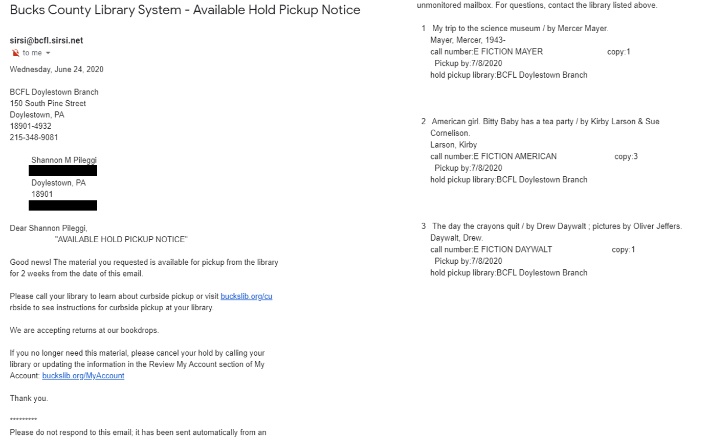

```{r setup, include=FALSE}
knitr::opts_chunk$set(echo = TRUE)
```

```{r load-data, echo = FALSE}
load(here::here( "_posts", "2021-01-11-from-gmailr-to-the-google-books-api", "data", "books.rda"))
```


# TL; DR

In the last six months of 2020, I read 214 children's books from the library with my daughters. The
`gmailr` and `httr` packages, and the Google Books API, allowed me to create a catalog of the books we read with preview images. You can [skip straight to the books](#books), or read on for code that follows these main steps with their primary packages.



# Background

I live in Doylestown, PA (Bucks County), with my husband and two daughters (2 and 5 years old). On March 14, 2020, the Bucks County library system closed due to COVID-19; on June 22, 2020, the library opened with curbside pick-up service. Every one to two weeks, I began to place children's books on hold (up to 15 at a time), and when a hold arrives, I receive an email notice like this:



Email notifications are sent around midnight, collating any books that 
arrived that day. As the email notifications trickled in and patterns emerged, I conceptualized a project to programmatically create a catalog of the library books we had placed on hold by extracting the books from my gmail and then augmenting their information from an API.

# Getting started

This material was developed using:

| Software / package  | Version               |
|---------------------|-----------------------|
| R                   | 4.0.3                 | 
| RStudio             | 1.3.1073              | 
| `tidyverse`         | 1.3.0                 |
| `gmailr`            | 1.0.0                 |
| `httr`              | 1.4.2                 |
| `lubridate`         | 1.7.8                 |
| `gt`                | 0.2.2                 |
| `glue`              | 1.4.1                 |
| `DT`                | 0.15                  |
 

```{r}
library(tidyverse) # general use ----
library(gmailr)    # retrieve emails  ----
library(httr)      # access api ----
library(lubridate) # repair dates ----
library(gt)        # for web_image helper function ----
library(glue)      # paste strings ----  
library(DT)        # interactive table ----  
```


# 1 {gmailr} retrieve library notifications from gmail 

I followed the [`gmailr` set up instructions](https://gmailr.r-lib.org/index.html#setup){target="_blank"} to authenticate myself and enable R's `gmailr`
package to interact with the Gmail API for my personal Gmail account, which was 
fairly straightforward. This required some point and click in other interfaces, 
followed by two lines of R code.

```{r, eval = FALSE}
gm_auth_configure(path = "path/credentials.json")
gm_auth()
```

Once authenticated, I retrieved the email notifications from my gmail account. It was not 
immediately clear to me how to do this, but this [stack overflow thread](https://stackoverflow.com/questions/62420703/extracting-all-emails-using-gmailr){target="_blank"} helped.  

```{r, eval = FALSE}
# 1 - retrieve messages corresponding to this search ----
messages <- gmailr::gm_messages("Bucks County Library System - Available Hold Pickup Notice")

# 2 - extract ids from messages corresponding to search ----
message_ids <- gmailr::gm_id(messages)

# 3 - extract contents from messages with these ids -----
message_full <- purrr::map(message_ids, gmailr::gm_message)

# 4 - extract message body from contents -----
message_body <- purrr::map(message_full, gmailr::gm_body)
```

This resulted in 67 email notifications from June 22, 2020 to December 30, 3020, containing from 1 to 11 books per email. Here is an example character string returned to me, corresponding to the email notification shown above.

```{r}
message_body[[66]]
```


# 2 {stringr} extract title and author from email

I then did my best to convert the date of the email notification, the book title, and book author to a tibble. This was a three step iterative process.

First, I created a list with the dates of the 67 emails. 

```{r}
# 1 - extract date of email notification ----
message_date <- purrr::map(
  message_body, 
    # start string at first character, end where 2020 ends ----
    ~ stringr::str_sub(.x , start = 1, end = str_locate(.x, "2020") %>% .[2]) %>% 
    # convert text string to date ----
    lubridate::mdy(.)
    )
```

```{r}
# view date corresponding to email notice ----
message_date[[66]]
```

Second, I did some initial cleaning to remove the introductory text, and then 
split the strings by numbers. 

```{r}
message_books <- purrr::map(
  message_body,  
    # remove formatting text, affect other stringr code ----
    ~ str_remove_all(.x, "[\\r|\\n]") %>% 
    # remove all introductory text ----
    str_remove(".* listed above.  ") %>%
    # split string when any number is identified ----
    str_split("[[:digit:]]   ")
)
```

```{r}
# view entries corresponding to email notice ----
message_books[[66]]
```

Third, I converted this to a tibble, removed all non-book rows, and iterated with 
`stringr` functions to get the title and author as best as I could. This was challenging
as not all entries had consistent formatting, and some adjustments I could make here
improved the Google Books API search later. Some of the `stringr` functions could
probably be collapsed, but the code mimics the steps I took and also allowed me
to easily backtrack on failed attempts.

```{r}
# split author and books into separate variables ----
books <- message_books %>% 
  # coerce list to tibble ----
  tibble() %>% 
  # rename first column ----
  rename("text" = 1) %>% 
  # unnest list text field ----
  unnest(cols = "text") %>%
  # merge in notice date ----
  mutate(notice_date = message_date %>% unlist() %>% as_date()) %>% 
  # unnest one more time ----
  unnest(cols = "text") %>% 
  # remove strings starting with spaces, these are not books ----
  filter(!str_sub(text, 1, 1) %in% c(" ", "")) %>% 
  # a lot of iteration here to extract author/title ----
  # sort by notice date before assigning id ----
  arrange(notice_date) %>% 
  mutate(
    # create id ----
    id = row_number(),
    # clean title until looks ok ----
    title = str_remove(text, " /.*") %>% 
      str_remove("Wells.*") %>%
      str_remove(" \\[.*") %>% 
      str_remove(": from.*") %>% 
      str_remove("\\*") %>%
      str_remove("Nino") %>% # affected api search ----
      str_remove("American [Gg]irl.") %>% # affected api search ----
      str_trim(),
    # clean author until looks ok ----
    author = str_remove(text, ".* /") %>% 
      str_remove("Sendak, Maurice") %>% 
      str_remove(" ; .*") %>% 
      str_remove("\\[") %>% 
      str_remove("\\]") %>% 
      str_remove(".* by ") %>%
      str_remove(".*! ") %>% 
      str_remove("and .*") %>%
      # remove everything after a period, but affected authors with first or middle initial ----
      str_remove("\\..*") %>% 
      str_remove("\\*") %>% 
      str_remove_all("& Sue .*| an |book") %>% 
      str_squish()
  ) %>% 
  # remove non pre-k books (I mostly read on kindle) ----
  dplyr::filter(!(title %in% c("Pax", "Luster", "Last night in Montreal : a novel"))) %>% 
  # count number of books per emails ----
  group_by(notice_date) %>% 
  add_count() %>% 
  ungroup()
```

```{r}
# view entries corresponding to email notice ----
books %>% 
  filter(notice_date == "2020-06-24") %>% 
  dplyr::select(text, title, author) %>% 
  knitr::kable()
```


# 3 {httr} query google books api

I then got started with the [Google Books API](https://developers.google.com/books){target="_blank"}. Some key steps in this process included:

1. Exploring [Google Books](https://books.google.com/){target="_blank"} and doing some manual searches to get a feel for how it behaves and what it returns.

2. Identifying the [format to get started](https://developers.google.com/books/docs/v1/getting_started#rest-in-the-books-api){target="_blank"} with the API:
`https://www.googleapis.com/books/v1/{collectionName}/resourceID?parameters`.

3.  Understanding the [search terms](https://developers.google.com/books/docs/v1/using#PerformingSearch){target="_blank"} permissible in the query (like `inauthor` and `intitle`): `https://www.googleapis.com/books/v1/volumes?q=search+terms`.

4. [Obtaining an API key](https://developers.google.com/books/docs/v1/using#APIKey){target="_blank"} (google console developer -> enable google books api -> create credentials -> calling API from other non UI -> get API key). However, this ended up being unnecessary for the search I executed.

Then I used the [`httr`](https://cran.r-project.org/web/packages/httr/vignettes/quickstart.html){target="_blank"} package to actually perform the query. First, I
defined the url.

```{r}
# url base format ----
url <- "https://www.googleapis.com/books/v1/volumes"
```

Next I created a wrapper function around `httr::GET` to allow for a search by 
title and author, or title alone.

```{r}
get_book <- function(this_title, this_author = NA){
  httr::GET(
    url = url,
    query = list(
      key = token, 
      q = ifelse(
        is.na(this_author),
        glue::glue('intitle:{this_title}'),
        glue::glue('intitle:{this_title}+inauthor:{this_author}')
        )))
}
```

I then performed an initial search with title and author. I learned that the 
API would error out with too many queries in quick succession, and I included `Sys.sleep` 
to slow down the search.

```{r, eval = FALSE}
# first search with title and author ----
# create progress bar for mapping ----
p <- dplyr::progress_estimated(nrow(books))
books_1 <- books %>%
  mutate(book_info = purrr::map2(title, author,
                                 function(x, y) {
                                   # print progress bar ----
                                   p$tick()$print()
                                   # add in delay for api ----
                                   Sys.sleep(1)
                                   get_book(x, y)
                                 }))
```

From there, I checked the status code, extracted book content, and checked to see
if any items were empty (which meant that no result was returned). In addition, 
more than one search result could have been returned; only the first was 
extracted.

```{r}
books_1_content <- books_1 %>%
  mutate(
    # extract status code: 200 = success ----
    status_code = purrr::map_int(book_info, "status_code"),
    # extract relevant content from author title search ----
    book_items = purrr::map(book_info, ~ httr::content(.x)[["items"]][[1]][["volumeInfo"]]),
    # check to see if items are empty ----
    empty_items = purrr::map_lgl(book_items, rlang::is_empty)
  )
```

The initial title and author search were all technically successful, though 10
searches results in empty items.  

```{r}
books_1_content %>% count(status_code, empty_items)
```
For these 10 items, I manually checked some with various searches on Google Books,
and I noticed that some actually did have an entry, but did not have an author in that entry, so I repeated the search but with title only.

```{r, eval = FALSE}
# 10 books did not have a result with author title search ----
p <- dplyr::progress_estimated(nrow(books))
# perform title search only ----
books_2 <- books_1_content %>%
  # keep only empty items for another search ----
  filter(empty_items == TRUE) %>%
  # keep original first six columns ----
  select(1:6) %>%
  mutate(book_info = purrr::map(title, 
                                function(x) {
                                  p$tick()$print()
                                  Sys.sleep(1)
                                  get_book(x)
                                }))
```


```{r}
books_2_content <- books_2 %>% 
  mutate(
    # extract status code: 200 = success ----
    status_code = purrr::map_int(book_info, "status_code"),
    # extract relevant content from author only search ----  
    book_items = purrr::map(book_info, ~ httr::content(.x)[["items"]][[1]][["volumeInfo"]]
  ),
  # check to see if items are empty ----  
  empty_items = purrr::map_lgl(book_items, rlang::is_empty)
)
```

These 10 items were all technically successful and contained result contents.

```{r}
books_2_content %>% count(status_code, empty_items)
```

In these two searches, I created a nested tibble with two nested lists: 

1. `book_info` is a very long list which contains the full result from the original query.

```{r}
# showing entry for a book in initial email notification ----
books_1_content[["book_info"]][[2]]
```

2. `book_items` contains into the specific bits of information I considered for extraction to augment book information.

```{r}
# showing entry for a book in initial email notification ----
str(books_1_content[["book_items"]][[2]])
```

# 4 {purrrr} extract content from search results

To assemble the final data, I combined the results of the two searches and
proceeded to extract information from `book_info`. A tricky part here was
that not all API results returned the same information, and if the named item did not exist the entire mapping would fail. My 
solution was to check if the named element existed for extraction, and otherwise 
return `NA`. I also checked to see if there was a fuzzy match between the 
author I originally extracted from the emails versus the author that the 
Google Books API returned.

```{r}
books_all <- books_1_content %>%
  # keep non-empty items from title author search ----
  filter(empty_items == FALSE) %>%
  # append results from title only search ---
  bind_rows(books_2_content) %>%
  # remove original api results ----
  dplyr::select(-book_info) %>%
  mutate(
    # extract fields from api results ----
    book_title = purrr::map_chr(book_items, ~ ifelse(
      rlang::has_name(.x, "title"), .x[["title"]], NA
    )),
    book_author = purrr::map_chr(book_items, ~ ifelse(
      rlang::has_name(.x, "authors"), str_c(unlist(.x[["authors"]]), collapse = ", "),
      NA
    )),
    book_publish_date = purrr::map_chr(book_items, ~ ifelse(
      rlang::has_name(.x, "publishedDate"), .x[["publishedDate"]], NA
    )),
    book_volume_link = purrr::map_chr(book_items, ~ ifelse(
      rlang::has_name(.x, "canonicalVolumeLink"), .x[["canonicalVolumeLink"]], NA
    )),
    book_image_link = purrr::map_chr(book_items, ~ ifelse(
      rlang::has_name(.x, "imageLinks"), .x[["imageLinks"]][["smallThumbnail"]], NA
    )),
    # clean book publish date to year only ----
    book_publish_year = str_sub(book_publish_date, start = 1, end = 4) %>% as.numeric(),
    # check for fuzzy matching of author from email vs api result ----
    author_fuzzy = purrr::map2(author, book_author, agrep),
    # if result is 1, there is a fuzzy match; otherwise, not ----
    author_match = purrr::map_lgl(author_fuzzy, ~ length(.x) > 0)
  )
```

If the authors matched, I assumed a matching result was returned. For the 13 authors that did not match, I manually inspected entries for further cleaning.

```{r, layout="l-body-outset"}
books_all %>% 
  filter(author_match == FALSE) %>% 
  # title, author from email; book_title, book_author from api ---
  select(id, title, author, book_title, book_author) %>% 
  knitr::kable()
```

Of these 13 books, I determined that there were:

* 3 instances where Google Books had missing author but the search result was a correct match

* 5 instances where the authors did not fuzzy match, but the search result was a correct match

* 5 instances with an incorrect match

I finished cleaning the books data with this in mind, and also formatted fields to show the thumbnail images and convert titles to links.

```{r}
books_clean <- books_all %>%
  #filter(author_match == TRUE) %>% 
  mutate(
    # replace author as extracted from email ----
    book_author = ifelse(is.na(book_author), author, book_author),
    # replace author as extracted from email ----
    book_author = case_when(
       # correct result not available from api search ----
       title %in% c("Raindrop, plop!", "Drawn together", "All the world", "Costume fun!", "Rudolph the Red-Nosed Reindeer") ~ author,
       TRUE ~ book_author
     ),
    # replace title as extracted from email ----
     book_title = case_when(
       # correct result not available on google books ----
       title %in% c("Raindrop, plop!", "Drawn together", "All the world", "Costume fun!", "Rudolph the Red-Nosed Reindeer") ~ title,
       TRUE ~ book_title
     ),
    # make volume link missing ----
     book_volume_link = case_when(
       # correct result not available on google books ----
        title %in% c("Raindrop, plop!", "Drawn together", "All the world", "Costume fun!", "Rudolph the Red-Nosed Reindeer") ~ NA_character_,
       TRUE ~ book_volume_link
     ),
     # make image link missing ----
     book_image_link = case_when(
       # correct result not available on google books ----
      title %in% c("Raindrop, plop!", "Drawn together", "All the world", "Costume fun!", "Rudolph the Red-Nosed Reindeer") ~ NA_character_,
       TRUE ~ book_image_link
     ),
     # make year missing ----
     book_publish_year = case_when(
       title %in% c("Raindrop, plop!", "Drawn together", "All the world", "Costume fun!", "Rudolph the Red-Nosed Reindeer") ~ NA_real_,
       TRUE ~ book_publish_year
     ),
     # create html text strings for display in table ----
     image_link_html = gt::web_image(url = book_image_link, height = 80),
     title_link_html = ifelse(
       is.na(book_volume_link),
       # if link unavailable, print title with no link ----
       book_title,
       str_c("<a href='", book_volume_link, "' target='_blank'>", book_title, "</a>")
     )
  ) %>% 
  arrange(id) %>% 
  # rename for table ---
  dplyr::select(
    ID = id,
    Preview = image_link_html, 
    Title = title_link_html, 
    `Author(s)` = book_author, 
    `Published` = book_publish_year, 
    `Notification` = notice_date
  ) 

```


# 5 {DT} present books in an interactive table {#books}

Finally! Over the last 6 months, we read 214 amazing books. If you aren't 
familiar with this type of table (I'm looking at you, Mom), note that this table
is _interactive_.  You can search for any word like "Carle" or "bear" in the search bar, change the number of entries shown, and sort by published date (for example) by using the light gray triangles in the header of the table.

```{r}
books_clean %>%
  DT::datatable(
    escape = FALSE,
    rownames = FALSE,
    options = list(
      columnDefs = list(
        list(className = 'dt-center', targets = c(1, 4, 5)),
        list(className = 'dt-left', targets = c(2:3))
      ),
      pageLength = 15,
      lengthMenu = seq(15, 225, by = 15)
    )
  )
```

# Technical reflection

This project was certainly a learning experience! I used the `gmailr` and `httr` packages for the first time, in addition to accessing my first API. Here are some of the challenges I faced:

1. My emails from the library did not always have consistent punctuation in reporting available books.

2. Book titles are not consistently presented; e.g., `Up up up down` in my email from the library vs `Up, Up, Up, Down!` in the Google Books result. 

3. Author names can be formatted differently across books (books with multiple authors or authors who identify with a middle initial, and period, in their name).

4. Authorship is not always consistently defined. For example, `I Can Read! Splat the Cat and the Quick Chicks` was attributed to Laura Driscoll according to the library (who actually wrote the text), but Rob Scotton according to Google Books (who wrote the original Splat the Cat books that this was based on).
 
5. The API results varied in information presented; for example, not all results contained authors or preview images.

6. Performing the API search in two phases (author and title vs title only) gave eight additional correct results and five additional incorrect results.  I'm not sure if that is worth it considering the manual effort to identify the incorrect results.

7. The books shown in my search are not necessarily the exact books that I read. For example, I did not read the 2021 edition of "What the Ladybird Heard" as shown in my final table, which would not have been available when I read it in October 2020. 

8. I encountered more issues with `NULL`, `integer(0)`, and empty items than ever before (which is not the same as `NA` `r emo::ji("laugh")`).

Alternative solutions to these challenges are welcome! You can download `books.rda` (which contains `message_body`, `books_1`, and `books_2`) from my [github repo](https://github.com/shannonpileggi/pipinghotdata_distill/tree/master/_posts/2021-01-11-from-gmailr-to-the-google-books-api/data){target="_blank"}.

# Personal note

Like many aspects of life, COVID-19 changed our relationship with the library. 
Previously, our family library experience consisted of leisurely browsing for a couple of books followed by a quick exit when the girls inevitably started playing hide and seek in the aisles. Instead, I now actively research children's books to check out. Without this change, I may have not have encountered many books that we now treasure. Completion of this cataloging project with preview images allows us to better recall the books we read together, and decide together which books we want to read again in the future. I hope that nurturing a love for books and reading can help to alleviate the lapse in formal pre-k education my children experienced this year.

# Acknowledgements

[Anthony Pileggi](https://github.com/anthonypileggi){target="_blank"} (my husband) talked me through my first API and discussed possible solutions to some coding challenges. Anthony is a data scientist currently specializing in e-commerce for outdoor power equipment at [Paul B. Moyer and Sons](https://poweredbymoyer.com/){target="_blank"}, and sometimes he makes fun R packages like [this](https://anthonypileggi.github.io/casino/){target="_blank"}.