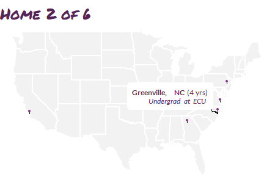

```{r setup, include=FALSE}
knitr::opts_chunk$set(echo = TRUE)
```

# TL;DR

To kick off my week curating the [`@WeAreRLadies`](https://twitter.com/WeAreRLadies){target="_blank"} twitter account I created a gif to introduce myself using [gganimate](https://gganimate.com/index.html){target="_blank"} and [ggtext](https://wilkelab.org/ggtext/){target="_blank"}.

# Getting started

This material was developed using:

| Software / package  | Version               |
|---------------------|-----------------------|
| R                   | 4.0.3                 | 
| RStudio             | 1.4.1103              | 
| `tidyverse`         | 1.3.0                 |
| `gganimate`         | 1.0.7                 |
| `extrafont`         | 0.17                  |
| `ggtext`            | 0.1.1                 |
| `glue`              | 1.4.1                 |


```{r}
library(tidyverse) # general use ----
library(gganimate) # to create animated gif ----
library(extrafont) # access and enable fonts ----
library(ggtext)    # style text in ggplot ----
library(glue)      # paste strings ----  
```

# Fonts

Fonts were challenging for me to get started with in R, and I got some great [tips on twitter](https://twitter.com/PipingHotData/status/1354993948931055623){target="_blank"}. I ended up manually installing new fonts on my Windows 10 OS and then using the [`extrafont`](https://cran.r-project.org/web/packages/extrafont/README.html){target="_blank"} package to access the fonts in R.

```{r, eval = FALSE}
# import fonts; only needed one time or after new font installation ----
# fonts may install to multiple directories; figure out where yours are installed ----
# and adjust path accordingly if needed ----
# this can take a while ----
extrafont::font_import()

# do this each R session in which you want to use fonts ----
extrafont::loadfonts(device = "win")

# examine font family names available for use (output not shown) ----
extrafont::fonts()
```


# The data

The data needed to create a map of the US is already contained within `ggplot2`.

```{r}
us_states <- ggplot2::map_data("state")
```

To show locations where I have lived, I manually compiled a data frame with city, state, latitude, longitude, and a description.  

```{r}
# use <br> to render line breaks with ggtext ----
residence <- tribble(
  ~city,           ~state,  ~lat,   ~long, ~years, ~description,
  "Raleigh",         "NC", 35.82,  -78.66,  17,    "Childhood",
  "Greenville",      "NC", 35.60,  -77.37,   4,    "Undergrad at ECU",
  "Atlanta",         "GA", 33.76,  -84.42,  10,    "Grad school at Emory<br>Statistician at CDC<br>Lecturer at Emory",
  "San Luis Obispo", "CA", 35.28, -120.66,   3,    "Asst. Professor at Cal Poly SLO",
  "Williamsburg",    "VA", 37.27,  -76.71, 0.5,    "Time with family",
  "Doylestown",      "PA", 40.31,  -75.13,   2,    "Statistician at Adelphi Research"
) 
```

Then I needed to create a transition state for gganimate  (`city_order`) as well as indicate connections between residences for the arrows.

```{r}
residence_connections_prelim <- residence %>% 
  mutate(
    # need this to create transition state ----
    city_order = row_number() + 1,
    # where I moved to next, for curved arrows ----
    lat_next = lead(lat),
    long_next = lead(long),
    # label to show in plot, styled using ggtext ---
    label = glue::glue("**{city}, {state}** ({years} yrs)<br>*{description}*"),
    # label of next location ----
    label_next = lead(label)
  ) 
```


Lastly, I modified this data a bit so that the first residence shows the label at the residence with no arrow and all remaining residences show an arrow with the label positioned at the next residence.

```{r}
residence_connections <- residence_connections_prelim %>%
  # get first row of residence ----
  slice(1) %>% 
  # manually modify for plotting ----
  mutate(
    city_order = 1,
    label_next = label,
    lat_next = lat,
    long_next = long,
    ) %>% 
  # combine with all other residences ----
  bind_rows(residence_connections_prelim) %>% 
  # last (7th) row irrelevant ----
  slice(1:6) %>% 
  # keep what we neeed ----
  dplyr::select(city_order, lat, long, lat_next, long_next, label_next)
```

```{r}
residence_connections
```

# Base map

For the map itself, I created a base map showing pins of the locations I have lived. Hex codes for R-Ladies colors were obtained from [this blog post](https://alison.rbind.io/post/2017-12-18-r-ladies-presentation-ninja/){target="_blank"} by Alison Hill. I briefly experimented with `coord_map` for projection, but then the subsequent curved arrows presented incorrectly.

```{r}
base_map <- ggplot() +
  # plot states ----
  geom_polygon(
    data = us_states,
    aes(
      x     = long, 
      y     = lat, 
      group = group
      ),
    fill  = "#F2F2F2",
    color = "white"
  ) +
  # lines for pins ----
  geom_segment(
    data = residence,
    aes(
      x    = long,
      xend = long,
      y    = lat,
      yend = lat + 0.5
      ),
    color = "#181818",
    size = 0.3
    ) +
    # pin heads, a bit above actual location, color with R ladies lighter purple ----
  geom_point(
    data = residence,
    aes(
      x = long, 
      y = lat + 0.5
      ),
    size = 0.5,
    color = "#88398A"
  ) +
  theme_void()
```

The sizing of the pins in the `base_map` appears different than in the gif below
as increasing the resolution of the output gif alters plotting ratios.

```{r}
base_map
```


# Animated map

```{r, eval = FALSE}
anim <- base_map +
  # show arrows connecting residences ----
  geom_curve(
    # do not include 1st residence in arrows as no arrow is intended ----
    # and inclusion messes up transition ---
    data = residence_connections %>% slice(-1),
    # add slight adjustment to arrow positioning ----
    aes(
      y     = lat - 0.1,
      x     = long,
      yend  = lat_next - 0.2,
      xend  = long_next,
      # group is used to create the transition ----
      group = seq_along(city_order)
    ),
    color = "#181818",
    curvature = -0.5,
    arrow = arrow(length = unit(0.02, "npc")),
    size  = 0.2
  ) +
  # add in labels for pins, with inward positioning ----
  # show labels either top left or top right of pin ----
  geom_richtext(
    data = residence_connections,
    aes(
      x     = ifelse(long_next < -100, long_next + 1, long_next - 1),
      y     = lat_next + 5,
      label = label_next,
      vjust = "top",
      hjust = ifelse(long_next < -100, 0, 1),
      # group is used to create the transition ----
      group = seq_along(city_order)
    ),
    size = 2,
    label.colour = "white",
    # R ladies purple ----
    color = "#562457",
    # R ladies font used in xaringan theme ----
    family = "Lato"
  ) +
  # title determined by group value in transition ----
  ggtitle("Home {closest_state} of 6") +
  # create animation ----
  transition_states(
    city_order,
    transition_length = 2,
    state_length = 5
    ) +
  # style title ----
  theme(
    plot.title = element_text(
      color = "#562457",
      family = "Permanent Marker",
      size = 12
      )
    )
```

```{r, eval = FALSE}
# render and save transition ----
# the default nframes 100 frames, 150 makes the gif a bit longer for readability ----
# changing dimensions for output w/ height & width ----
# increasing resolution with res ----
animate(anim, nframes = 150, height = 2, width = 3, units = "in", res = 150)
anim_save("homes_animation.gif")
```

{width=70%}


# Discussion    

I hope this gif helped you learn a little bit about me! I'm a southern
girl who was never quite cool enough for California still learning how to navigate
personalities in the northeast. `r emo::ji("joy")` 

I do have two additional short-term residences not shown here. Although I was born in Raleigh, NC, I lived in Accra, Ghana until I was 1 year old (my father served in the US military and worked at the American Embassy in Accra). I also lived in Seville, Spain for a semester abroad during college. 

In this gif I did not include transitions between countries. In addition, aligning sizing with resolution of the output device took some experimentation. 

I would love to get to know you through your gif - if you happen to replicate this
for yourself please share with me on [Twitter](https://twitter.com/PipingHotData){target="_blank"}, [LinkedIn](https://www.linkedin.com/in/shannon-m-pileggi/){target="_blank"}, or [email](mailto:shannon@pipinghotdata.com){target="_blank"}! I also invite you improve this gif with cooler transitions, international locations, awesome styles, or anything else. `r emo::ji("happy")` `r emo::ji("purple heart")`

