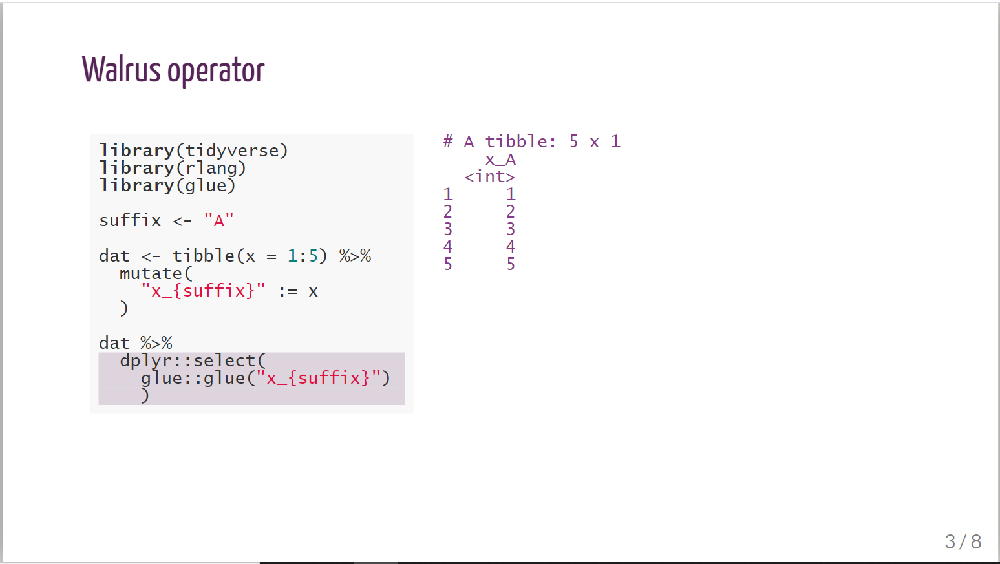

```{r setup, include=FALSE}
knitr::opts_chunk$set(echo = TRUE)
```


# TL; DR

I curated the [`@WeAreRLadies`](https://twitter.com/WeAreRLadies){target="_blank"} twitter account from Feb 15 - 20, 2021. During my curation, I shared brief R code gifs created with [`xaringan`](https://slides.yihui.org/xaringan/#1){target="_blank"},   [`flipbookr`](https://github.com/EvaMaeRey/flipbookr){target="_blank"},
a bit of custom CSS, and the [`ScreenToGif`](https://www.screentogif.com/){target="_blank"} recorder. Full code is available in the [rladies-flipbookr](https://github.com/shannonpileggi/rladies-flipbookr){target="_blank"} repo; here is an example gif:

```{r echo=FALSE, fig.cap="Walrus operator gif."}
knitr::include_graphics("gifs/demo-walrus-flipbook-quality.gif")
```

# Getting started

This material was developed using:

| Software / package  | Version               |
|---------------------|-----------------------|
| R                   | 4.0.3                 | 
| RStudio             | 1.4.1103              | 
| `tidyverse`         | 1.3.0                 |
| `xaringan`          | 0.19                  |
| `flipbookr`         | 0.1.0                 |


# Creating slides

The `flipbookr` [template](https://github.com/EvaMaeRey/flipbookr#template){target="_blank"} makes it easy to quickly create content! I used the classic flipbook, with defaults to walk through the code pipeline (slides 3-4 in the template).

To create a flipbook slide that advances code line by line, create a named R
code chunk with the `include = FALSE` option, and then present the code chunk with `flipbookr::chunk_reveal`. The order of defining the chunk versus revealing the chunk does not matter in your RMarkdown document. Longer content was broken into multiple code 
chunks.

`` `r knitr::inline_expr('chunk_reveal("walrus", title = "## Walrus operator")')` ``


````markdown
```{r walrus, include = FALSE}`r ''`
library(tidyverse)
library(rlang)
library(glue)

suffix <- "A" 

dat <- tibble(x = 1:5) %>%
  mutate(
    "x_{suffix}" := x
  ) 

dat %>% 
  dplyr::select(
    glue::glue("x_{suffix}")
    ) 
```
````

# Styling slides

I first styled the content used Alison Hill's [R-Ladies xaringan theme](https://alison.rbind.io/project/rladies-xaringan/){target="_blank"} by declaring
R-Ladies CSS options in the `yaml` parameters:

`css: ["default", "rladies", "rladies-fonts"]`

resulting in

```{r echo=FALSE, fig.cap="Flipbookr walrus operator content styled with R-Ladies xaringan theme."}
knitr::include_graphics("img/walrus-default.PNG")
```

However, the highlighting shade was a tad too dark for me, and I was 
concerned that the font size would be too small to be legible in a gif on twitter. I updated the CSS with bits lifted from [xaringan templates](https://github.com/yihui/xaringan/tree/master/inst/rmarkdown/templates/xaringan/resources){target="_blank"} and some modifications on font size and color kindly developed by [Silvia Canelón](https://silvia.rbind.io/){target="_blank"}. 

```{r echo=FALSE, fig.cap="Flipbookr walrus operator content styled with R-Ladies xaringan theme adjusted with lighter highlight shade and larger font size."}

```


The changes are subtle, but I hope they improve readability! The increased font size did create a challenge for code formatting and for the amount of code that could be shown on a single slide.

Silvia showed me how to modify the CSS through (1) inclusion of a CSS code chunk, and (2) calling a [separate CSS sheet](https://github.com/shannonpileggi/rladies-flipbookr/blob/main/css/rladies-adjusted.css){target="_blank"}. For option (2), change the yaml to
point to your custom CSS:

`css: ["default", "default-fonts", "css/rladies-adjusted.css"]`

You can see the full code for the default xaringan theme and the two ways of adjusting the
CSS for all the gifs I created in the  [shannonpileggi/rladies-flipbookr](https://github.com/shannonpileggi/rladies-flipbookr){target="_blank"} github repository.

If you have configured a GitHub personal access token, you can fork and clone
this repo with:

```{r, eval = FALSE}
usethis::create_from_github("shannonpileggi/rladies-flipbookr")
```


# Recording the gif

I recorded the gifs by manually advancing the slides with the screen recorder [`ScreenToGif`](https://www.screentogif.com/){target="_blank"} (for Windows OS). 
Bryan Shalloway has some code to [automatically create gifs from xaringan slides](https://github.com/brshallo/flipbookr-gifs-examples){target="_blank"}, but I didn't go that route this time - maybe next!

# Code gifs shared

Here are the R code gifs that I shared on twitter during my `@WeAreRLadies` curating week:

1. [walrus operator](https://twitter.com/WeAreRLadies/status/1361802517735178243){target="_blank"}

2. [mutate_at + vars + matches](https://twitter.com/WeAreRLadies/status/1362442398790516741){target="_blank"}

3. [mutate + across + matches](https://twitter.com/WeAreRLadies/status/1362450901445865472){target="_blank"}

4. [haven + gtsummary](https://twitter.com/WeAreRLadies/status/1363186751133667330){target="_blank"}

5. [named color vectors + scale_color_manual](https://twitter.com/WeAreRLadies/status/1363286611971170304){target="_blank"}

# Other options

During my curating week, I learned about the [carbonate](https://github.com/yonicd/carbonate){target="_blank"} package! This also seems like a fantastic option for aesthetically appealing code sharing.

# Accessibility

Visual code sharing through gifs and images can be a great way to share 
content! However, please remember to share the content with everyone. Gifs and images on their own are not accessible to members of our community that use assistive technology to read digital content. In order to make gifs and images accessible to screen readers, you can include [descriptions](https://help.twitter.com/en/using-twitter/picture-descriptions){target="_blank"} or share code in otherwise accessible formats like [GitHub gists](https://gist.github.com/){target="_blank"}. If I miss making
any of my content accessible, please let me know!


# Acknowledgements

I have to give [Silvia Canelón](https://silvia.rbind.io/){target="_blank"} ([`@spcanelon`](https://twitter.com/spcanelon){target="_blank"}) a **huge** shout out here. My curating week started on a Monday, and on Monday night I was still trying to figure out how 
I wanted to style my code. We chatted on [R-Ladies slack](https://rladies-community-slack.herokuapp.com/){target="_blank"}, and she quickly helped me make CSS adjustments to the default xaringan R-Ladies theme. After the curating week, Silvia helped me fine tune the bits to share that are now in the [rladies-flipbookr](https://github.com/shannonpileggi/rladies-flipbookr){target="_blank"} repo. Additionally, she advises me on inclusivity and accessibility best practices, which I am still striving to meet. Thank you, Silvia! `r emo::ji("purple heart")` `r emo::ji("pray")`

Lastly, thanks to the friendly [RStudio Community](https://community.rstudio.com/){target="_blank"} forum for helping me figure out both the [in line verbatim](https://community.rstudio.com/t/rmarkdown-verbatim-in-line-code/98165){target="_blank"} I used in this post and the [dplyr::select portion](https://community.rstudio.com/t/tidy-eval-glue-custom-names-w-dplyr-select/95010){target="_blank"} of the walrus operator gif. 

# Outtakes 

I experimented with, and actually recorded, some alternative formats before 
I landed on `flipbookr`. Here are two gifs that didn't make the cut! `r emo::ji("see-no-evil monkey")`


```{r echo=FALSE, fig.cap="Walrus operator gif recorded as a scrolling RMarkdown document."}
knitr::include_graphics("gifs/demo-walrus-rmarkdown.gif")
```


```{r echo=FALSE, fig.cap="Walrus operator gif recorded as code submitted to console."}
knitr::include_graphics("gifs/demo-walrus-console.gif")
```


