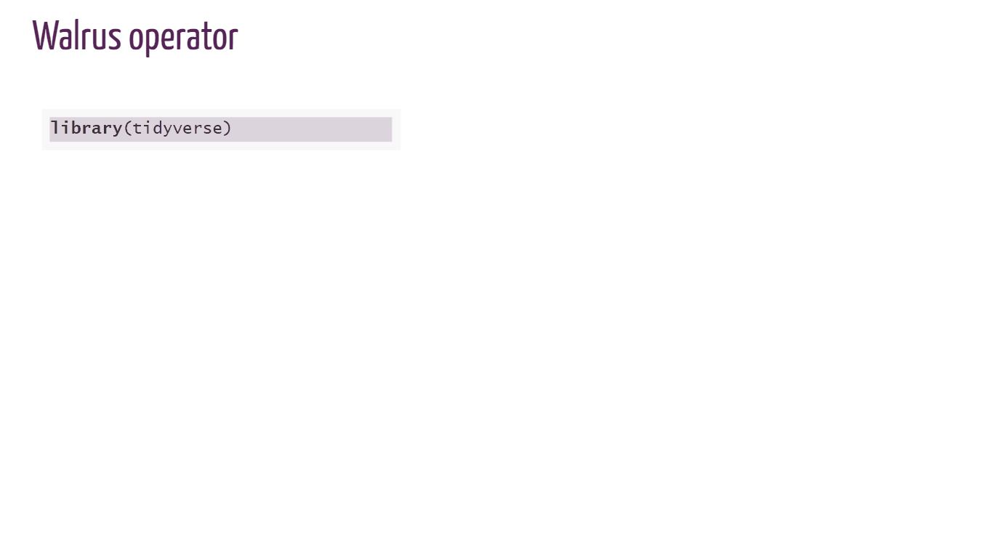

```{r setup, include=FALSE}
knitr::opts_chunk$set(echo = FALSE)
```

```{r}
folder <- "2021-03-14-curating"
```

```{r}
library(tidyverse)
library(ggtext)
library(ggiraph)
```

_i don't love the title_

_title & description 1:_

Curating a public garden

Before, during, and after my week curating for `@WeAreRLadies` on Twitter

_title & description 2:_ 

Before, during, and after my week curating for `@WeAreRLadies` on Twitter

Cultivating connections and collaborations through Twitter curation

_title & description 3:_

From strategy to fruition: Curating for `@WeAreRLadies` on Twitter

?


preview image: maybe a cute behind the curtain? something with a bird? open windows/open doors?

opening windows: https://unsplash.com/photos/XYBnYhMqaVg

open door to public garden: https://unsplash.com/photos/tCT032aX0Ds

purple lit hallway: https://www.pexels.com/photo/purple-string-lights-and-lamps-with-curtains-1042152/

# TL; DR

_needs more work_

In February 2021 I served as the [`@WeAreLadies`](https://twitter.com/WeAreRLadies){target="_blank"} rotating curator. I tweeted [a lot](https://twitter.com/spcanelon/status/1363518469782843396){target="_blank"} and had some [blunders](https://twitter.com/PipingHotData/status/1364183660744896513){target="_blank"}; it was a great opportunity to share knowledge, connect with others with similar interests, and learn something in return.


_alt_

In February 2021 I tweeted to a daunting >20k followers by curating for [`@WeAreLadies`](https://twitter.com/WeAreRLadies){target="_blank"} on Twitter, ultimately cultivating new connections
and collaborations. From strategy to fruition, I hope this post helps you confidently enroll as a curator!

# About `@WeAreRLadies`

The `@WeAreRLadies` rotating Twitter curator exists to "encourage and maintain Twitter engagement within the R-Ladies community", and to "spotlight female and minority genders" working with R. R-Ladies has a [comprehensive guide](https://guide.rladies.org/rocur/about/){target="_blank"} describing the program, procedures and protocols for the week, and tips for successful curation. 

# Date selection

You can view the [schedule](https://docs.google.com/spreadsheets/d/1pmphnR9EinGuAKbVqGzMIt6cWYmHNbeFVzaKJB59JdY/edit#gid=1429703967){target="_blank"} of upcoming curators to identify available dates; records of previous curators are also maintained here.  

Being a curator will be time intensive, so be kind to yourself. Choose dates when you will have time to invest and a flexible work schedule. I chose Feb 15-20 
because I hoped by then I would be recovered from an intense Q4 work cycle;
additionally, Feb 15 (President's Day) was a company holiday. Additionally, you may
want to select a date far enough in the future that allows you time to prepare
content.

Another consideration is to schedule your curation to coincide with dates that align with your interests. For example, are you passionate about Black History Month in February, LGBT Pride Month in June, or Universal Human Rights Month in December? 
If so, take advantage of the `@WeAreRLadies` large platform as an opportunity to inform and educate others on issues that are important to you as they relate to the 
R community.

# Signing up

You sign up by [submitting a form](https://docs.google.com/forms/d/e/1FAIpQLSevtboT8TNjz87qe5HZzuBHuY0aNteaZNF5e2xFQXtSeU0c0w/viewform){target="_blank"} - give yourself at least 30 minutes to sign up as part of the
form includes filling out details that complete your [curating profile](https://twitter.com/WeAreRLadies/status/1361139211819180032){target="_blank"}.


# Timeline

_This section needs more work,or cut, or just bit about manager?_

_1. Graphical or table presentation or none?_

_2. For table - format with inline options vs knitr-esqe options?_

_3. some overlap here with drafting content section, where best placed?_

I gave myself three months between signing up and my selected date to start strategizing. 
After enrolling, I regularly jotted down quick content ideas as they surfaced.

About three weeks before my curation, I started planning my curating efforts a bit more
seriously. I notified my manager that I was curating, and I discussed potential work-related content with her. One idea was approved and another was reasonably denied. This honest conversation alleviated my concerns about Twitter curation potentially impacting my work either through time spent or content shared. Discussing this with her also facilitated new awareness about my passions - my manager was not aware of R-Ladies, and she was enthusiastic and supportive.


_table or graphical presenation worth it?_

```{r}
timeline <- read_csv(here::here("_posts", folder, "data", "rladies_timeline.csv")) %>% 
  mutate(
    even_odd = (id %% 2) == 0,
    label = glue::glue("*{time_frame} before*<br>{str_wrap(action, 10)}")
    )
```


```{r}
timeline %>% 
  dplyr::select(time_frame, action)
```


_Alternative presentation: I don't think this figure has much promise, maybe
just stick to table format._

```{r}
timeline %>% 
  ggplot() +
  geom_segment(aes(x = 1, xend = 7, y = 0, yend = 0), size = 0.5) +
  geom_segment(aes(x = id, xend = id, y = 0, yend = ifelse(even_odd, -.3, 0.3)), size = 0.3) +
   geom_richtext(
    aes(
      x     = id,
      y     = ifelse(even_odd, -.3, 0.3),
      label = label,
      #vjust = "top",
      #hjust = ifelse(long_next < -100, 0, 1),
    ))
```


# Drafting content

Leading up to my curation week, I regularly jotted down brief notes of content ideas.
The week before curation, I started fleshing out those ideas into actual tweets and wrote them down in a document. Not all of my ideas ended up in a draft,
and rarely did the draft get tweeted out exactly as I had written. 

One challenge with drafting tweets in a document was being mindful of character limits
and anticipating where the breaks would be for threads. I started copying content into a send tweet window to preview and then pasting it back into my draft document. There is software that facilitates drafting tweets - for example, [Daphna Harel](https://twitter.com/DaphnaHarel){target="_blank"} recommended
 [getchirrapp.com](https://getchirrapp.com/){target="_blank"} to me the week of my curation.
 
Not all content was premeditated - I also tweeted in the moment. For example, the [W.E.B. Du Bois'](https://twitter.com/WeAreRLadies/status/1362016896116219904?s=20){target="_blank"} `#TidyTuesday` visualizations were incredible that week, or when I [realized](https://twitter.com/WeAreRLadies/status/1362509983368249346?s=20){target="_blank"} a new colleague wasn't yet taking advantage of RStudio projects.

# Content inspiration

_can't decide if this should go upfront or later_

As I approached my curating week, I recalled previous `@WeAreRLadies` that were
memorable for me, my previous experience as an educator, and some reflection
questions to inspire content.

| Inspiration  source | Example realization   |
|---------------------|-----------------------|
| 1. Rotating curator Mine Çetinkaya-Rundel ([`@minebocek`](https://twitter.com/minebocek){target="_blank"}) tweets awesome [gifs](https://twitter.com/WeAreRLadies/status/1064704918102163457){target="_blank"}| Gifs for R code demos like [this one](https://twitter.com/WeAreRLadies/status/1361802517735178243){target="_blank"}  |
| 2. Rotating curator Megan Stodel ([`@MeganStodel`](https://twitter.com/MeganStodel){target="_blank"}) tweets a [project](https://twitter.com/WeAreRLadies/status/1313177623128944645){target="_blank"} inspired by curating | An R project to [introduce myself](https://twitter.com/WeAreRLadies/status/1361286341317779456){target="_blank"} as a curator |
| 3. Rotating curator Julia Piaskowski ([`@SeedsAndBreeds`](https://twitter.com/SeedsAndBreeds){target="_blank"}) tweets a great technical thread on [ANOVA](https://twitter.com/WeAreRLadies/status/1223790298024726528){target="_blank"} | A thread on [blogging resources](https://twitter.com/WeAreRLadies/status/1363144545677017089){target="_blank"} |
| 4. Prior experience as an educator | Starting discussion with a [question](https://twitter.com/WeAreRLadies/status/1361332603274612739){target="_blank"} |
| 5. What am I passionate about lately? | [Blogging](https://twitter.com/WeAreRLadies/status/1363144545677017089){target="_blank"} |
| 6. What did I have to overcome to be where I am today? | Learning how to [ask for help online](https://twitter.com/WeAreRLadies/status/1362370580708790274){target="_blank"} |
| 7. What have colleagues or students asked me about? | What needs [updating](https://twitter.com/WeAreRLadies/status/1362114431090573315){target="_blank"}  and when |
| 8. What are some R functions or packages that have helped me recently? | [sortable ](https://twitter.com/WeAreRLadies/status/1361418527870132226){target="_blank"} package |
| 9. What are R-Ladies voices I can amplify while I have this large platform? | Quote tweeting questions like [this](https://twitter.com/WeAreRLadies/status/1362866281918128132){target="_blank"} |


# Polls

As I already mentioned, I love starting discussion with questions! Reminiscing about my 
days teaching in large lectures halls with students actively participating in polling questions through clickers, I planned three polls for the week. Polls on twitter are open for 24 hours and allow up to four response options. The approach was to launch the poll, collect responses, and then discuss. Here are the polls that I launched during my curation:

```{r}
polls <- read_csv(here::here("_posts", folder, "data", "rladies_polls.csv")) %>% 
  mutate(
    day = factor(day, levels = c("Monday", "Tuesday", "Wednesday", "Thursday",
                             "Friday", "Saturday")),
    poll_label = glue::glue("Poll #{poll}") %>% fct_reorder(poll),
    tweet_label = glue::glue("Tweet #{step}") %>% fct_reorder(step) %>% fct_rev(),
    step = factor(step) %>% fct_rev() %>% fct_drop(),
    content = str_wrap(content, 12),
    content_label = glue::glue("{type}:\n{content}"),
    content_click = sprintf("window.open(\"%s%s\")", url, ""),
    content_url = 
       str_c("<a href='", content, "' target='_blank'>", url, "</a>")
    )
```


```{r}
#tooltip_css <- "background-color:gray;color:white;padding:10px;border-radius:5px;"
```


```{r}
p <- polls %>% 
  ggplot(aes(x = 1, y = tweet_label, fill = poll_label, tooltip = embed, onclick = content_click)) +
  facet_wrap(. ~ day, ncol = 6, drop = F) +
  geom_tile_interactive(color = "white") +
  geom_text(aes(label = content_label), size = 2.5) +
  theme_minimal() +
  theme(
    # removes grid lines from plot ----
    panel.grid = element_blank(),
    # moves legend to top instead of side ----
    legend.position = "top",
    # removes title from legend, often superfluous ----
    legend.title = element_blank(),
    # creates the light gray box around the plot, may or may not want this ----
    #panel.background = element_rect(color = "#F2F2F2"),
    # creates the gray background boxes for faceting labels ----
    strip.background = element_rect(
      color = "#F2F2F2",
      fill = "#F2F2F2"
    ),
    # this produces a fully left justified title ----
    plot.title.position = "plot",
    axis.text.x = element_blank(),
    axis.title.x = element_blank(),
    #axis.text.y = element_blank(),
    axis.title.y = element_blank(),
    )
```

_What do you think of this graphical presentation? The graphic has both hover enabled to show the tweek and click enabled to take you to the tweet. The hover over was taken from embed tweet on twitter and runs off the page - I would need to make adjustments
here for readability if I keep.  Also need a custom color scheme._


```{r}
girafe(ggobj = p,
       #opts_tooltip(use_fill = TRUE)
       #opts_tooltip(css = tooltip_css, use_fill = TRUE)
       )
```


# Styling content

Additionally, I considered how to visually style content beyond text in a tweet. I asked on [R-Ladies slack](https://rladies-community-slack.herokuapp.com/){target="_blank"} about R-Ladies styles, and I was directed to the xaringan R-Ladies [css](https://github.com/yihui/xaringan/tree/master/inst/rmarkdown/templates/xaringan/resources){target="_blank"} and the R-Ladies [branding](https://guide.rladies.org/organization/tech/brand/){target="_blank"} guides. You are not required to use R-Ladies style and branding, but it was convenient for me. 

I developed two visual layouts using the Google slide [template](https://docs.google.com/presentation/d/1sriC2biLPYza_TtGiZkrNDsv3AMg6dvhqw2yit4wNnA/edit){target="_blank"} from R-Ladies branding (see tweets for [blogdown vs dstill](https://twitter.com/WeAreRLadies/status/1363144545677017089){target="_blank"} and [asking for help online](https://twitter.com/WeAreRLadies/status/1362370580708790274){target="_blank"}).

```{r echo=FALSE, fig.cap="Comparison of blogdown vs distill styled using R-Ladies Google slide template."}
knitr::include_graphics("img/compare_blogdown_distill.svg")
```


I also created five R-Ladies styled code gifs with xaringan and flipbookr - methods and code are in this [blog post](https://www.pipinghotdata.com/posts/2021-03-08-r-ladies-styled-code-gifs-with-xaringan-and-flipbookr/){target="_blank"}. Here is an example code gif:

```{r echo=FALSE, fig.cap="Example R-Ladies styled code gif."}

```


# First and last tweets

The introduction and farewell tweets as a curator are important as this is when you actually tell people your name or personal twitter handle. I have seen 
many excellent curators fall short on engagement (likes and re-tweets) with their first and last tweets, resulting in less than merited recognition for the wonderful curator. 

To address this, I aimed to create content-rich [first](https://twitter.com/WeAreRLadies/status/1361286341317779456){target="_blank"} and [last](https://twitter.com/WeAreRLadies/status/1363286037846511616){target="_blank"} tweets to give users more motivation to like or re-tweet, and I also connected the content with links to my blog so that users could easily learn more about me.

# TweetDeck

When you serve as a curator, you will be tweeting from [TweetDeck](https://tweetdeck.twitter.com/){target="_blank"}, and it is hard to separate curator experience from the technology. Tweeting from TweetDeck can be overwhelming compared to the standard Twitter interface.

Moreover, there were limitations to the platform that added challenges to curating, which included:

1. There was no `+` enabled to easily create threads (I had to send a tweet and then comment on the tweet, and it was initially hard to ensure the thread appeared in correct order).

2. Consequently, I could not draft and save threads in TweetDeck to send later.

3. I could not send polls from the curator account on TweetDeck; polls were sent from my personal account and then re-tweeted from the curator account.

4. Depending on the content already in the send tweet interface, sometimes other options in TweetDeck would disappear, like the emoji, gifs, and upload image buttons. I kept [emojipedia](https://emojipedia.org/){target="_blank"} open to easily copy and paste emojis into my tweets, and it took trial and error to get everything I wanted in a single tweet.

5. When uploading local content, you can add [descriptions](https://help.twitter.com/en/using-twitter/picture-descriptions){target="_blank"} to both gifs and images in the regular Twitter interface to create inclusive content for community members that use assistive reading technology; however, in TweetDeck, descriptions were enabled for images but not gifs.

I spent a lot of time my first couple of days as a curator getting used to TweetDeck, reaching out to other curators for tips, and researching alternative solutions and plug-ins that ultimately did not help. Twitter is targeting TweetDeck [enhancements](https://www.theverge.com/2021/3/9/22321991/twitter-tweetdeck-overhaul-redesign-product-changes){target="_blank"} later in 2021, so I don't think it is worth documenting all of my methods and work-arounds. However, if you are serving as a curator and struggling with TweetDeck, please reach out - I am happy to share what ended up working for me. You can also prepare yourself by practicing tweeting from TweetDeck with your personal account prior to curating.

# Reflection

_this is getting long, break into multiple sections?_

Between prepared and ad-hoc content and discussions with followers, I tweeted a lot! (At least for me.)  Here is a [summary thread](https://twitter.com/spcanelon/status/1363518469782843396){target="_blank"} of my tweets for the week. My tweets were not perfect, and that is okay. I messed up threads, had typos, and shared deprecated code, among other things. Check out my [blooper reel](https://twitter.com/PipingHotData/status/1364183660744896513){target="_blank"} for tweets that I bungled.

One regret that I do have from my curating week is failing to explicitly knowledge Black History Month as I was tweeting in February. I wish had prepared at least one tweet or better amplified the voices of black members of the R community while I had the large platform. 

Just because a twitter account has >20K followers, the likes, re-tweets, and comments don't come automatically. You still have to earn engagement with your content. Many of the tweets I sent had little engagement, and that is okay. Supporting your curators by engaging with their tweets or sending notes of encouragement is _much_ appreciated. I thank everyone who engaged with me during my curation, with a special shout out to Alison Hill who re-energized me mid-week with comments on the R-Ladies bloggers [thread](https://twitter.com/WeAreRLadies/status/1362021673239785473){target="_blank"}.

Serving as a curator was intimidating and time consuming, but I am very glad I did it. Many good things have happened as direct result of that week, including: 

* [discussing](https://twitter.com/WeAreRLadies/status/1363144545677017089){target="_blank"} comparisons between `{blogdown}` and `{distill}` with Alison Hill 

* [collaborating](https://www.pipinghotdata.com/posts/2021-03-08-r-ladies-styled-code-gifs-with-xaringan-and-flipbookr/){target="_blank"} with Silvia Canelón to style code gifs

* engaging with new people on twitter that I want to continue to engage with

* learning about valuable new-to-me packages, functions, and work flows 

* being invited to speak for R-Ladies Miami

* seeing my "Asking for help online" content re-used in Sharla Gelfand's ["make a reprex... please"](https://twitter.com/sharlagelfand/status/1365665149063987201){target="_blank"} presentation

* co-developing a unit testing workshop with [Gordon Shotwell](https://twitter.com/gshotwell/status/1362769538631221251){target="_blank"}

During my curating week I tried to embody the tweets that I value: honest questions, thoughtful discussion, generous sharing, supportive community, and humorous exchanges. And to borrow from Vicki Boykis in the rstudio::global(2021) [keynote](https://rstudio.com/resources/rstudioglobal-2021/your-public-garden/){target="_blank"}, I created my own public garden that cultivated new connections and collaborations. 

# Acknowledgements

