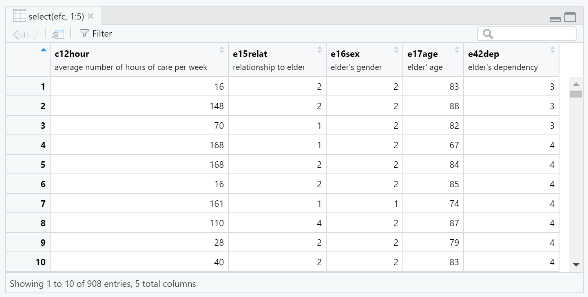

```{r setup, include=FALSE}
knitr::opts_chunk$set(echo = TRUE)
```

# TL;DR

Variable labels in R can improve data documentation and workflows.

# Getting started

```{r}
library(tidyverse)
library(labelled)
library(sjlabelled) # for example efc data set
```

# Overview

Metadata such as variable labels may be typically associated with SAS, Stata,
or SPSS data sets; however, they can be assigned in R as well!

# Data with variable labels

I have previously written about [Leveraging labelled data in R](https://www.pipinghotdata.com/posts/2020-12-23-leveraging-labelled-data-in-r/) - this 
is from the perspective of importing SAS, SPSS, or Stata data into R that 
come with variable labels.

As an example of what this might look like in R, check out the `efc` data
set in the `sjlabelled` package.

```{r}
#| eval: FALSE
efc |> 
  select(1:5) |> 
  View()
```

```{r thumbnail, eval=TRUE, echo=FALSE}
#| fig.cap: > 
#|   Screenshot of view of efc data from the {sjlabelled} package in RStudio. Variable labels
#|   are printed underneath variable names.
#| fig.alt: > 
#|    Screenshot of view of efc data from the {sjlabelled} package in RStudio. Variable labels
#|   are printed underneath variable names.

```

```{r}
efc |> 
  select(1:5) |> 
  str()
```


# Assign variable labels

## Manual

## Automatic

# Create a data dictionary

# Variable labels and {gtsummary} ... gt?

# Variable labels and {ggplot}

# Exporting data with variable labels

# Details

# Acknowledgments
