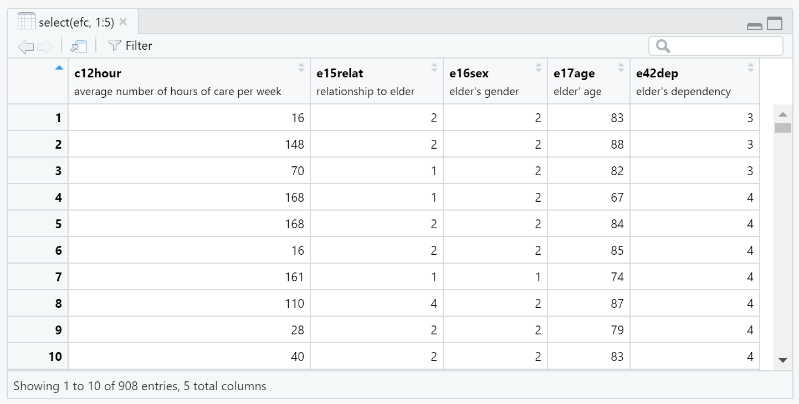
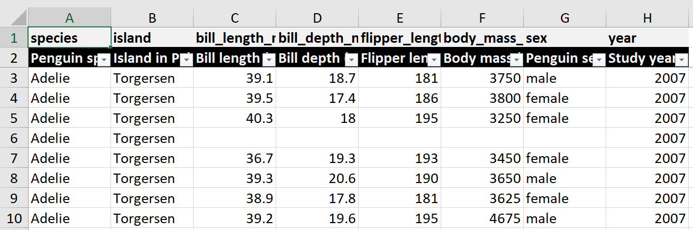

```{r setup, include=FALSE}
knitr::opts_chunk$set(echo = TRUE)
```

```{r, echo=FALSE}
this_post <- here::here("_posts", "2022-09-08-variable-labels")
```


# TL;DR

Variable labels can be quickly assigned in R, and can improve workflows
via self-explaining, data dictionaries, and applications in summary tables,
ggplot, and exporting.

# Packages

This material was developed using:

| Software / package  | Version               |
|---------------------|-----------------------|
| R                   | 4.2.0                 | 
| RStudio             | 2022.07.1+554         | 
| `tidyverse`         | 1.3.1                 |
| `labelled`          | 2.9.1                 |
| `sjlabelled`        | 1.2.0                 |
| `gtsummary`         | 1.6.1                 |
| `palmerpenguins`    | 0.1.0                 |

```{r}
library(tidyverse)      # general wrangling
library(labelled)       # for general functions to work with labelled data
library(sjlabelled)     # for example efc data set with variable labels
library(palmerpenguins) # example data set
library(gtsummary)      # to demonstrate automatic use of variable labels in summary tables
```


# Introduction

I do believe in the idea of ["Column Names as Contracts"](https://emilyriederer.netlify.app/post/column-name-contracts/){target="_blank"} 
as described by Emily Riederer. However, there exist situations in which one
does not have control of column names, or in which column names are restricted
to certain conventions incompatible with detailed column names. If this applies, a 
labelled data workflow may be useful.

A labelled data workflow is one in which readable variable _labels_ are assigned to variables.
Two reasons to adopt a labelled workflow are:

1. If you have obscure variable names that you do not wish to or cannot change, but from
which programming would be easier if you could quickly glean meaning.

2. If you have readily understood variable names, but want something more descriptive or
human readable for sharing data products like tables or figures.

I have previously written about [Leveraging labelled data in R](https://www.pipinghotdata.com/posts/2020-12-23-leveraging-labelled-data-in-r/) - this is from the perspective of importing SAS, SPSS, or Stata data into R that come with variable labels.

What about if you have data that do not arrive with variable labels? You can still
assign variable labels in R, and it is a workflow I am adopting with increasing
frequency.


# Data with variable labels


As an example of what data with variable labels might look like in R, check out 
the `efc` data set in the [`sjlabelled`](https://strengejacke.github.io/sjlabelled/index.html){target="_blank"} package.

```{r}
#| eval: FALSE
efc |> 
  select(1:5) |> 
  View()
```


```{r thumbnail, eval=TRUE, echo=FALSE}
#| fig.cap: > 
#|   Screenshot of view of efc data from the {sjlabelled} package in RStudio. Variable labels
#|   are printed underneath variable names.
#| fig.alt: > 
#|   Screenshot of view of efc data from the {sjlabelled} package in RStudio. Variable labels
#|   are printed underneath variable names.

```


Here, you an see the variable labels printed underneath variable names. The first
variable shown is `c12hour` - what is that? Underneath the variable name, the
variable label of `average number of hours of care per week`
provides additional context without having to leave your data.

You can also see variable labels by examining the structure of the data set.
Labels are stored as attributes of the variables; note that `label` refers the 
variable labels, whereas `labels` refers to the value labels (not further 
discussed in this post).

```{r}
data(efc)

efc |> 
  select(1:5) |> 
  str()
```


# Assign variable labels

What if your data do not come with variable labels? I imagine this would be the 
case for the majority of users. If this applies to you, you can assign variable 
labels via both manual and more automatic methods. For demonstration, I'll
use the `penguins` data set from the [{palmerpenguins}](https://allisonhorst.github.io/palmerpenguins/){target="_blank"} package.

## Manual

You can manually assign variable labels with `set_variable_labels()` 
from the [{labelled}](https://larmarange.github.io/labelled/){target="_blank"} package. 
The variable name is on the left hand side and the variable
label is on the right hand side.

```{r}
penguins_labelled <- penguins |> 
  set_variable_labels(
    species           = "Penguin species",
    island            = "Island in Palmer Archipelago, Antarctica",
    bill_length_mm    = "Bill length (mm)",
    bill_depth_mm     = "Bill depth (mm)",
    flipper_length_mm = "Flipper length (mm)",
    body_mass_g       = "Body mass (g)",
    sex               = "Penguin sex",
    year              = "Study year"
  )
```

Confirm that the variable labels were correctly assigned via `View()` or
`str()`.

```{r}
# View(penguins_labelled)
str(penguins_labelled)
```

## Automatic

If you have a lot of variables, the manual assignment could get tedious. However,
if you are lucky, your data may arrive with tables of metadata. Suppose you could quickly
import a data frame, with one column for the variable names and another 
for variable labels. As we don't have an external metadata available for the
`penguins` data, here is an example data frame.

```{r}
penguins_metadata <- tribble(
    ~variable,           ~variable_label, 
    "species",           "Penguin species",
    "island",            "Island in Palmer Archipelago, Antarctica",
    "bill_length_mm",    "Bill length (mm)",
    "bill_depth_mm",     "Bill depth (mm)",
    "flipper_length_mm", "Flipper length (mm)",
    "body_mass_g",       "Body mass (g)",
    "sex",               "Penguin sex",
    "year",              "Study year"
)
penguins_metadata
```

To quickly assign the variable labels, first create a named vector via [`deframe()`](https://tibble.tidyverse.org/reference/enframe.html){target="_blank"} 
with values as the variable labels and names as the variable names.

```{r}
penguins_labels <- penguins_metadata |> 
  deframe()

penguins_labels
```

Now assign the labels using the  [splice operator](https://rlang.r-lib.org/reference/splice-operator.html){target="_blank"}. 
Using the splice operator, labels are assigned via matching against the variable name, which means that 
variable order does not matter.

```{r}
penguins_labelled <- penguins |> 
  set_variable_labels(!!!penguins_labels)
```

Voilà! The variable labels have been assigned again.

```{r}
# View(penguins_labelled)
str(penguins_labelled)
```

# Uses

## 1. Self-explaining

Having your data accompanied by variable labels in your working environment,
rather than having to switch to external documents to glean meaning,
is empowering and speeds up workflows.

## 2. Create a data dictionary

You can quickly create a data dictionary 
with `labelled::generate_dictionary()` to get an overview of your metadata. 
It is convenient to search this within the RStudio data viewer to find variables of interest.

```{r}
penguins_dictionary <- penguins_labelled |> 
  generate_dictionary()
```


```{r}
penguins_dictionary |> 
  knitr::kable()
```

For more fully fledged codebook options, check out
Crystal Lewis's [codebook comparisons](https://github.com/Cghlewis/codebook-pkg-comparison).

## 3. Variable labels in summary tables

If you want to create summary tables of your data, [{gtsummary}](https://www.danieldsjoberg.com/gtsummary/index.html){target="_blank"}
handily uses the variable labels (if available), rather than variable names,
to provide human readable and readily interpretable output.

```{r}
penguins_labelled |> 
  select(island, species, bill_length_mm) |> 
  tbl_summary(
    by = species
  ) |> 
  bold_labels()
```


## 4. Variable labels and {ggplot}

This is the best I could come up with to apply variable labels in ggplot, and it
isn't fully satisfying. If there is a slicker solution to automatically
display variable labels, rather than variable names, please let me know!


```{r}
penguins_labelled |> 
  ggplot(aes(x = bill_length_mm, y = bill_depth_mm, color = species)) +
  geom_point() +
  labs(
    x = penguins_labels[["bill_length_mm"]],
    y = penguins_labels[["bill_depth_mm"]],
    color = penguins_labels[["species"]]
    )
```


## 5. Exporting data with variable labels

For work, we have an in-development public facing package [{croquet}](https://github.com/pcctc/croquet){target="_blank"},
which contains a single frequently used function: `add_labelled_sheet()`. This function
exports data to excel with row one as variable names, and row two as the descriptive
variable labels with filters automatically applied.

```{r, eval= FALSE}
# devtools::install_github("pcctc/croquet")
library(croquet)
library(openxlsx)

wb <- createWorkbook()
add_labelled_sheet(penguins_labelled)
saveWorkbook(wb, "penguins_labelled.xlsx")
```


```{r, eval= FALSE, echo=FALSE}
# devtools::install_github("pcctc/croquet")
library(croquet)
library(openxlsx)

wb <- createWorkbook()
add_labelled_sheet(penguins_labelled)
saveWorkbook(wb, here::here(this_post, "penguins_labelled.xlsx"))
```


```{r, eval=TRUE, echo=FALSE}
#| fig.cap: > 
#|   Screenshot of excel output from `croquet::add_labelled_sheet()`
#| fig.alt: > 
#|   First row has light gray backround with variable names in black; second
#|   row has black backgrounding with variable labels in gray, and excel
#|   drop down filters on each column.

```

Exporting data with labels on row two feels unnatural as the data is 
no longer tidy, but it helps to quickly communicate variable meaning to 
collaborators comfortable with excel.

# Final thoughts

I enjoy a labelled data workflow. It both enhances my productivity and streamlines
my data products. I am curious if the set up is worthwhile for others as well! And
please let me know if you have other labelled data applications or workflows not included here.

# Acknowledgments

I found the ggplot labeling strategy in Lefkios Paikousis's blog post ["A workflow with labelled data"](https://lefkiospaikousis.netlify.app/posts/2020-12-23-a-workflow-with-labelled-data/){target="blank"},
which also presents other ggplot labeling tips for value labels.

