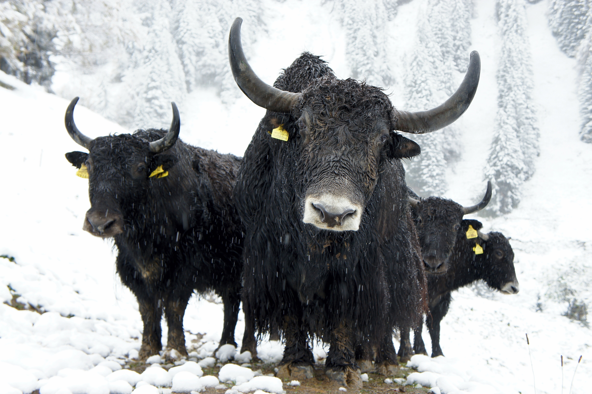

```{r setup, include=FALSE}
knitr::opts_chunk$set(echo = FALSE)
```

```{r}
library(tidyverse)
library(tweetrmd)
```

```{r thumbnail, eval=TRUE, echo=FALSE}
#| fig.cap: > 
#|  Photo by <a href="https://unsplash.com/@lievemax?utm_source=unsplash&utm_medium=referral&utm_content=creditCopyText">Lieve Ransijn</a> on <a href="https://unsplash.com/s/photos/yak?utm_source=unsplash&utm_medium=referral&utm_content=creditCopyText">Unsplash</a>, which reflects how I often
#|  feel, facing multiple yaks on challenging terrain.
#| fig.alt: > 
#|    Four black yaks on a dirt path in a snow-covered mountain landscape. One yak
#|    is in the lead, staring into the camera; three yaks are behind.

```


# TL; DR

This post summarizes a conversation with Jenny Bryan about yak shaves,
which helped me approach technical learning processes with a focused and positive mindset.

[1. Background.](#background)

[2. What is yak shaving?](#yakshave)

[3. A productive yak shaving framework:](#framework) regular, intentional, and time-boxed.

[4. My personal reflection on this mentality.](#reflection)

Throughout, text in quote blocks with "JB" are direct quotes from Jenny.


# 1. Background {#background}

[Jenny Bryan](https://jennybryan.org/){target="_blank"}, a Software Engineer at Posit (formerly RStudio), is known for developing R packages and educational materials, especially as they relate to creating efficient workflows. A year ago, Jenny tweeted advice regarding the concept of "yak shaving" that made
the process of self-improvement sound logical, structured, and easy. 

```{r}
tweetrmd::include_tweet("https://twitter.com/JennyBryan/status/1366107942487949312")
```

But learning new methods in or related to R can be a daunting and overwhelming process.
It is easy to feel like everyone else knows _X_, and you are behind. The learning
is not necessarily linear, and often there is not a well-defined set of milestones to aspire to.
I thought about it for a long time, and...

```{r}
tweetrmd::include_tweet("https://twitter.com/PipingHotData/status/1368037504499265540")
```

To slightly paraphrase my thread: How do you identify problems worthy of intentional yak shaving? 
How do you time box? Does your time end when your problem is "solved", or do you settle
with some problems that have a less than satisfying solution? There are many things
that I chase with out a resolution - is it OK for me to move on even if I suspect
it will come back to me?

Apparently I wasn't the only one.

```{r}
tweetrmd::include_tweet("https://twitter.com/KellyBodwin/status/1368099045894320136?s=20&t=J5vJrmgkGaUDpeMTqM68hw")
```

And very kindly, Jenny offered to chat with me further.

```{r}
tweetrmd::include_tweet("https://twitter.com/JennyBryan/status/1368052293183021057?s=20&t=UeP93VlZzXpxnXdo95MoUQ")
```

Now, on to a summary of our conversation. 😊

# 2. What is yak shaving? {#yakshave}

I had never heard of a yak shave before, so I read a bit about it.
Yak shaving is a term used frequently in software engineering; a [definition from Jessica Kerr](https://jessitron.com/2017/07/03/a-taxonomy-of-yak-shaving/){target="_blank"} is, "Doing seemingly-unrelated tasks to get some real task done." Read Jessica's post [One key trick to becoming a wizard developer](https://jessitron.com/2021/02/27/one-key-trick-to-becoming-a-wizard-developer/){target="_blank"}
for an example of a yak shave.

For some, the yak shave can have negative connotations as a time suck that prevents 
a goal from realization (see [Don't Shave That Yak](https://seths.blog/2005/03/dont_shave_that/){target="_blank"} by Seth Godin).
Others, like Jenny and Jessica, frame it as a growth opportunity, if well-positioned.

Individuals also classify the yak shave in various ways (like
Jessica Kerr's [taxonomy of yak shaving](https://jessitron.com/2017/07/03/a-taxonomy-of-yak-shaving/){target="_blank"} 
with five types of yaks) and for various purposes (like Elliot Williams's [hacker vs maker mode](https://hackaday.com/2016/08/09/yak-shaving-hacker-mode-vs-maker-mode/){target="_blank"}). 

To narrow down the scope of the yak shave for this this post, consider topics like:

* Learning how complicated tasks mostly out of our control interact with each other. 

* Iterating on workflows that can be improved. 

* Adopting a productive debugging mindset that creates a deeper understanding.

> JB: The kind of thing I’m thinking of is fundamentally _reactive_ and not _proactive_ or _creative_.

# 3. A productive yak shaking framework {#framework}

Here, we break down Jenny's three yak shaving adjectives: regular, intentional, and time-boxed.

## Intentional 

> JB: I record little hangnails or things I don’t understand in a running “notes to self” document.
And often that will provide evidence that the same “little thing” keeps coming up, over and over again. 
Then eventually I’ll take the time to get to the bottom of it.

Good candidates for a yak shave include tasks

* of high frequency, 

* with tedious workarounds, or

* where deeper understanding could alleviate pain points.

> JB: Solving workflow problems that affect every single project you work on has great impact.

## Regular

> JB: I don’t schedule it intentionally. But I mean more that I take some (but not all!)
opportunities to yak shave productively on a regular basis. It’s a regular part of my life.

Yaks differ in size and scope: some may be completed in an hour, a day, or span multiple days.

> JB: I’d say I shave a mini yak on most days, a medium yak, most weeks and large yak once a month? 

Of course, this depends on the competing demands of your brain resources. 

> JB: There are some times where you’re really working to deadline or have a complicated
problem loaded into your brain and that is NOT when I do this.

Be kind to  yourself. 

> JB: Usually right after you’ve completed a big chunk of work and you’re settling into the next thing?
That’s a good time shave a well-chosen yak. Often it’s a shavable yak that came by during that last project and you found a workaround and stayed focused. But now you’re circling back for a more proper exploration and, if you’re lucky, solution.

## Time-boxed

Time boxing can be flexible, as tasks differ in size and scope. Time boxing also
does not necessarily mean that you hold yourself to completing a task
in a single setting. 

> JB: I liked how Jessie mentioned in the blog post that she actually did take
the easy way out, to get unstuck and get her thing committed and pushed. But then
she circled back later to get to the bottom of it. I think this is a good idea, 
i.e. don’t let the perfect be the enemy of the good and embrace MVPs^[An MVP is 
a minimal viable product, which is an early version that can provide the foundation 
for future development.]. 

It can help to return to the problem at hand over time, perhaps even outside of prime work hours.

> JB: That also often forces you to think about it a little, drop it, sleep, do other 
stuff, then pick it up again. So you often get an idea while you’re doing something
else or see something new when you return with fresh eyes.

# 4. Personal reflection {#reflection}

> JB: I don’t think of this as me sharing some great wisdom, just that I’ve had
a chance to give myself permission to really think about these things, given my life at RStudio.
As a professor, things felt much more complicated. It felt harder to decide what was legitimate, 
“real” work. And it probably made skill development harder than it needed to be.

Prior to this conversation, I didn't recognize some of my learning efforts as yak shaves.
I felt like I was scrambling to keep up and questioning if I was spending my hours
wisely and on worthwhile efforts. 

Struggling to figure out new systems or write better code does not always feel 
productive in the moment, but I believe all learning is good learning, 
even if you are learning what does not work. And when I feel like my wheels are 
churning in quicksand, I often breathe deeply and repeat the mantra to myself: 
_All learning is good learning. All learning is good learning. All learning is good learning._

There is a balance to strike between yak shaves and reality. 
On occasions that I do challenge myself to dig deeper, it is worth it for both my own
personal satisfaction, and as Jenny said, to become a better developer and team member.
I am also at peace with the times where I coast on the status quo for my own sanity.

Creating this positive mindset towards incremental learning has been especially
important to me this year as I transitioned from my formal domain expertise as a Statistician
into a new role as a Data Scientist, where I suspect that I will be happily learning
new-to-me programming concepts for many years to come.

After this chat with Jenny, I felt better about myself: where I am in my 
current state of knowledge, what I am spending my time on learning, and 
where I am going in the future. By sharing this conversation, I hope you feel the same.

# Acknowledgements

I am very grateful to Jenny Bryan for kindly chatting with me. I am also grateful
to [Megan McClintock](https://www.linkedin.com/in/megan-mcclintock/){target="_blank"}
(my sister) for providing editorial feedback on this post.

```{r}
knitr::knit_exit()
```

yak
https://pngtree.com/freepng/cute-and-cute-consuming-cow-clipart_6030475.html
<a href='https://pngtree.com/so/Cute'>Cute png from pngtree.com/</a>

box
https://pngtree.com/freepng/open-courier-box_929631.html

https://unsplash.com/photos/FsJ_vzp_NI4

Photo by <a href="https://unsplash.com/@lievemax?utm_source=unsplash&utm_medium=referral&utm_content=creditCopyText">Lieve Ransijn</a> on <a href="https://unsplash.com/s/photos/yak?utm_source=unsplash&utm_medium=referral&utm_content=creditCopyText">Unsplash</a>
  
  
  Photo by <a href="https://unsplash.com/@blunkorama?utm_source=unsplash&utm_medium=referral&utm_content=creditCopyText">Daniel Lloyd Blunk-Fernández</a> on <a href="https://unsplash.com/s/photos/yak?utm_source=unsplash&utm_medium=referral&utm_content=creditCopyText">Unsplash</a>
  