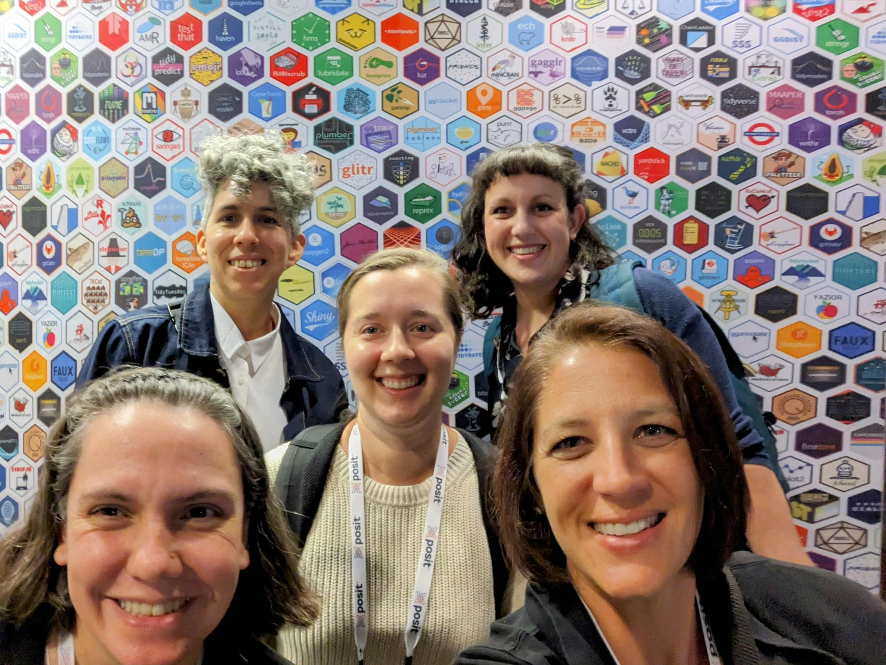
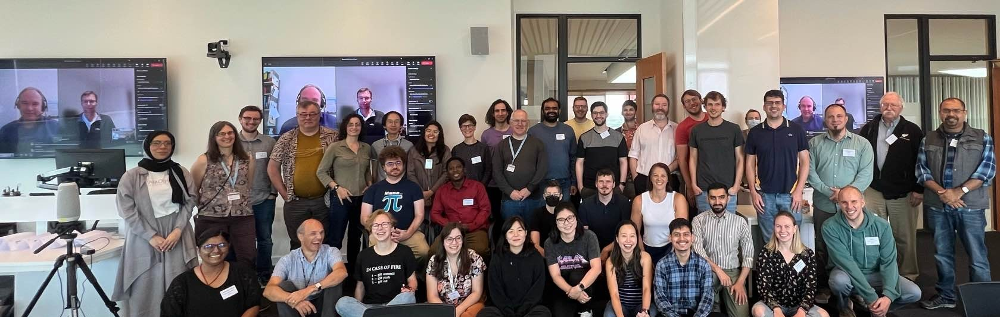
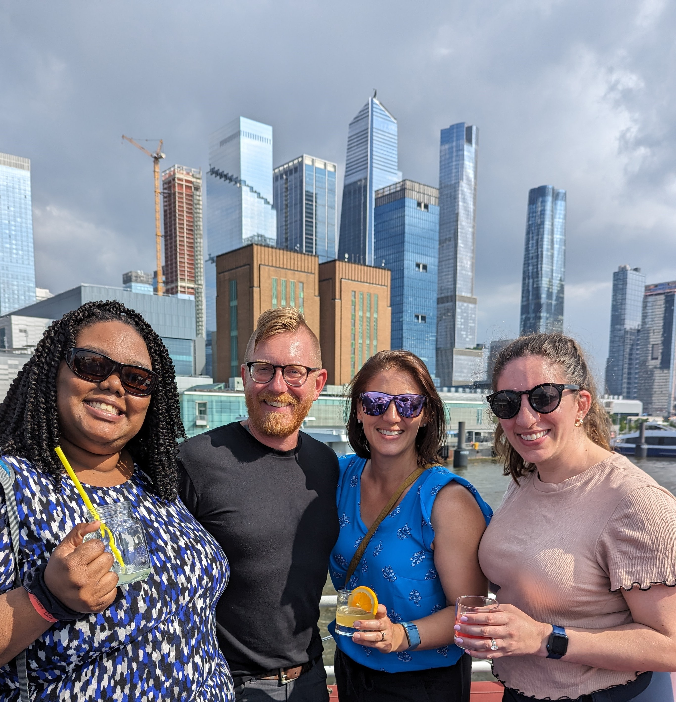
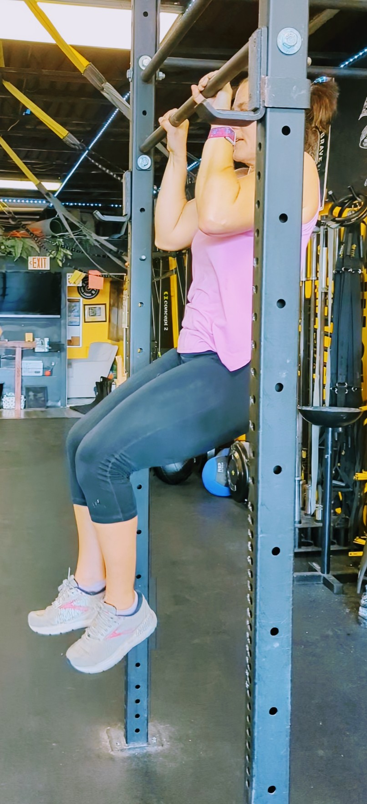
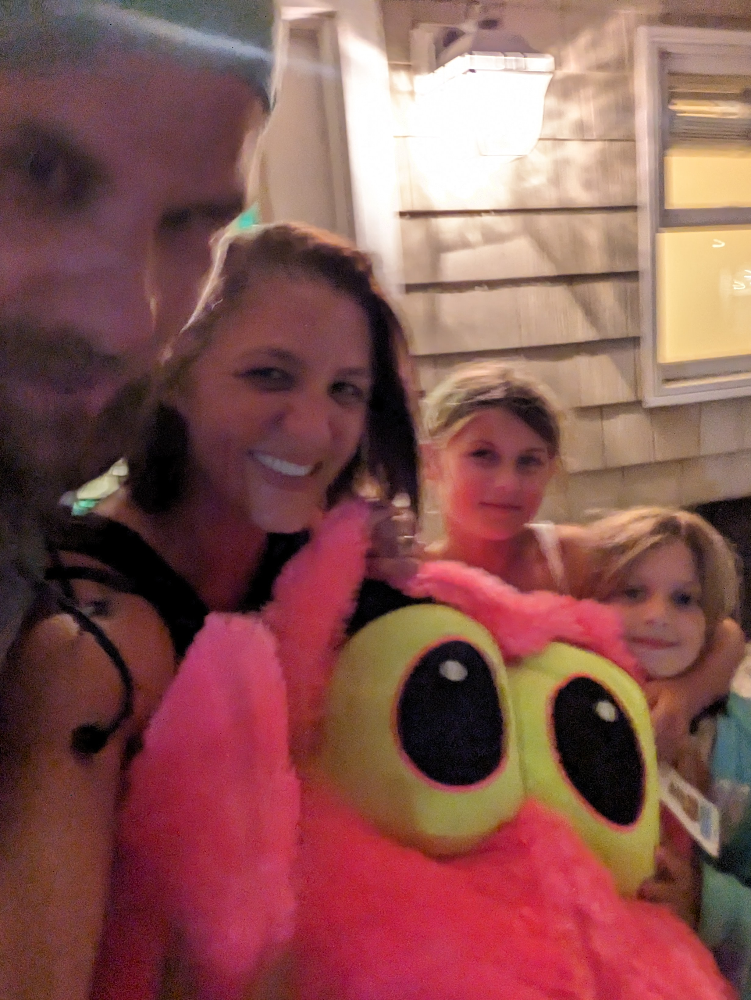

# TL DR

Highlights from this year included focusing on personal health and wellness,
joining the R-Ladies Leadership Team, participating in the R Project Sprint,
and teaching various workshops.

# Professional

## R-Ladies

It has been such an honor to join the Leadership Team of [R-Ladies Global](https://rladies.org/)! I am 
grateful to volunteer alongside and serve such talented, dedicated, and 
thoughtful individuals on the Leadership Team, the wider Global Team, 
and the broader R-Ladies community. To learn more about what we have been up to watch the beautiful presentation [Sustainable Growth of Global Communities: R-Ladies' Next Ten Years](https://www.youtube.com/watch?v=awTzbYXTlSc&list=PL9HYL-VRX0oRFZslRGHwHuwea7SvAATHp&index=10)
by Riva Quiroga at posit::conf(2023) and read the website [News](https://rladies.org/news/).

```{r, eval=TRUE, echo=FALSE}
#| fig.cap: > 
#|    Riva Quiroga (Chile), Athanasia Mowinckel (Norway), Averi Giudicessi (US), 
#|    Yanina Bellini Saibene (Argentina), and Shannon Pileggi (US) of the R-Ladies
#|    Leadership Team meeting in person for the first time at posit::conf(23).
#| fig.alt: > 
#|    5 women standing together taking a selfie in front of a wall full
#|    of hex stickers.

```

## R Project Sprint

I learned how to contribute to base R at the R Project Sprint in
Coventry, England. This was an amazing experience to meet in person with diverse
programmers from around the world - you can read more in my [R Project Sprint](https://www.pipinghotdata.com/posts/2023-09-07-r-project-sprint/) blog post.

```{r, eval=TRUE, echo=FALSE}
#| fig.cap: > 
#|    R Project Sprint participants, with remote participants shown on video conference. Not
#|    all [particpants](https://contributor.r-project.org/r-project-sprint-2023/participants/){target="_blank"} photographed. 
#| fig.alt: > 
#|    38 participants in-person in a classroom space: 1st row sitting on floor, 
#|    2nd row kneeling or sitting in chairs, 3rd row standing. Two remote participants
#|    shown on video conference in screen to the left of the group.

```

## Teaching

I still really enjoy teaching, and I am grateful for the opportunities I have teach
on the side! This year I taught:

* 6 2-hour workshops for R-Ladies Meet-ups.

* A 1-day [What They Forgot To Teach You About R](https://github.com/posit-conf-2023/wtf)
workshop at posit::conf(2023), co-instructed with E. David Aja.

* A 3-hour [Cleaning Medical Data with R](https://shannonpileggi.github.io/rmedicine-data-cleaning-2023/) workshop at R/Medicine 2023, co-instructed
with Crystal Lewis and Peter Higgins.

```{r, eval=TRUE, echo=FALSE}
#| fig.cap: > 
#|    Shannon Pileggi and E. David Aja teaching "Using version control" for R-Ladies Philly
#|    in preparation for posit::conf(23).
#| fig.alt: > 
#|    Shannon and David stand in front of a projected slide that has an image of a
#|    disarry of silver forks, knives and spoons with the title "Using... control"
#|    shown - "version" is blocked by David's head.
knitr::include_graphics("img/git.jpg")
```


## Work

I have been working remotely for the [Prostate Cancer Clinical Trials Consortium (PCCTC)](https://pcctc.org/) since October, 2021,
and I still really enjoy it! I generally spend my days thinking deeply about data, 
coding, and how to count things. A big shift for me this year was moving to more of
a managerial role as our team grew, and I now have three direct reports. This resulted 
in a lot of code review, which includes checking for code efficiency, reproducibility, 
documentation of reasoning, understanding of the input data, confirming correct derivation of new
variables, and ensuring polished deliverables.

```{r, eval=TRUE, echo=FALSE}
#| fig.cap: > 
#|    Meghan Harris, Travis Gerke, Shannon Pileggi, and Victoria Catherine of the PCCTC
#|    Data Science team at an all company in-person meeting in New York City.
#| fig.alt: > 
#|    Meghan, Shannon,and Victoria are wearing sunglasses and holding cocktails.  
#|    Photo taken on a boat; background is water and shiny, tall city buildings.

```


## Writing

This is only my 2nd blog post this year, which is an intentional drop
from previous years. I do still enjoy writing, but it is time consuming
and I did accept other responsibilities. Also, see the [Personal](#personal) section. 

## Other

I attended PHUSE Connect US 2023 in person in Orlando, Florida in February (a 
Clinical Data Science Conference). This was my first conference in the industry
and it was wonderful to connect with and learn from others. At the conference I presented [Introducing {gtreg}: an R package to produce regulatory tables for clinical research](https://shannonpileggi.github.io/gtreg-talk-phuse-2023/#/title-slide), a
package I collaborated on with Daniel Sjoberg to easily make beautiful adverse 
event tables^[Yes, I think great tables are beautiful.]. 

# Personal {#personal}

This year I have also focused on my health and well-being. This included efforts
in consuming a balanced diet^[Yes, I count my macros on the MacroFactor app.], 
getting sufficient sleep at night^[Yes, I track my sleep on Whoop.], and exercising^[Yes, I join a gym.].

## Reading

Part of getting sufficient sleep meant cutting back on tinkering at my computer
late a night (hence less writing) and instead reading to relax at bedtime. I
read over 25 fiction novels this year (compared with ~3 the previous year);
highlights included _Demon Copperhead_, _A Thousand Splendid Suns_, 
_Remarkably Bright Creatures_, and the Scholomance trilogy.

## Exercise

The gym I joined focuses on both metabolic training and weight training, and it has
a wonderful community culture. The new routine resulted in a significant amount
of weight loss and strength gain^[Yes, I'd be happy to chat about how much
I can deadlift, bench press, etc., any time.]. I am proud to say I can do 
unassisted chin-ups and pull-ups for the first time in my life! 

```{r, eval=TRUE, echo=FALSE}
#| fig.cap: > 
#|    Shannon doing a pull-up.
#| fig.alt: > 
#|    Shannon is off the ground, holding on to a bar overhead, with arms at 90 degrees,
#|    head about to come above the bar.

```

## Vacations

Lastly, as a family we also focused on planning time away. We had a great mix
of both individual and family vacations, that we look forward to continuing in the 
future.

```{r, eval=TRUE, echo=FALSE}
#| fig.cap: > 
#|    My family on our beach vacation, triumphantly bringing home a massive
#|    stuffed snake that we won at the arcade.
#| fig.alt: > 
#|    Photo taken at night in front of a porch light and is blurry; Dad, Mom, and 
#|    two girls huddled in front of a large pink snake head with bright yellow eyes.

```

# Acknowledgements

Thanks to [Yanina Bellini Saibene](https://yabellini.netlify.app/), whose 
amazing year end reviews inspired me to write my own. I am always in awe
of how much [she accomplishes](https://yabellini.netlify.app/blog/2022-12-31-year-in-review/).

