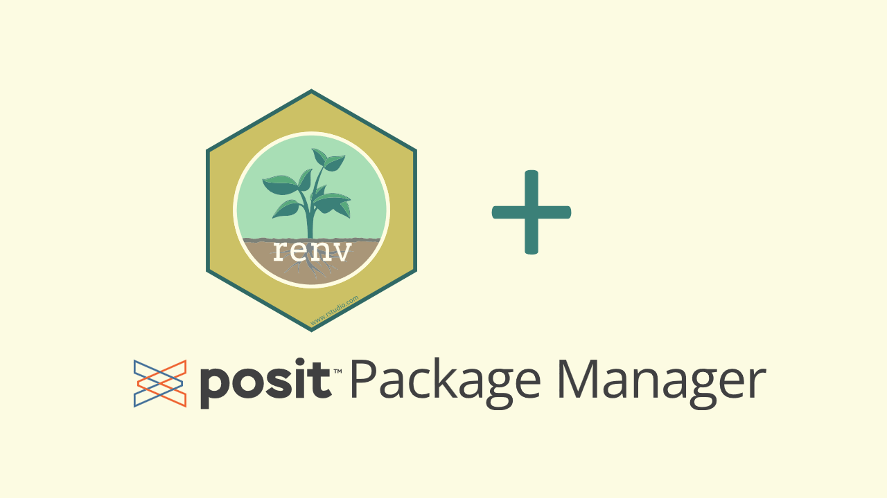

```{r, eval=TRUE, echo=FALSE}
#| fig.alt: > 
#|    Logo/hex sticker from {renv} and logo for posit Package manager with a 
#|    plus sign in between.

```

# TL; DR

Updating a `renv` project's package repository from CRAN to Posit Public Package 
Manager allows a user to more quickly install previous versions of R packages. 
It is also easy and free!

# Background

The `{renv}` package is wonderful for documenting and controlling package versions within 
an R project. See [You should use renv](https://youtu.be/GwVx_pf2uz4?si=agbC-r-us57GF-7f) by E. David Aja at rstudio::conf(2022) for motivation and [Introduction to renv](https://rstudio.github.io/renv/articles/renv.html) for how to get started.

# Package restoration

`{renv}` facilitates restoration of specific versions of packages documented
in the `renv.lock` via `renv::restore()`, which installs packages from
a specified repository. In the `renv.lock`, for many users the repository specification
might look something like this by default:

```
   "Repositories": [
      {
        "Name": "CRAN",
        "URL": "https://cloud.r-project.org"
      }
    ]
```

This will vary user to user based on their specific settings and configurations.
What this means is that `{renv}` is going to that specific url to find and install
packages that are available there. In this case, we are installing from
the cloud instance of a CRAN mirror.

However, if the packages documented in the `renv.lock` are of an older version, then the binaries for this package are likely no longer available on CRAN. This means that
when `{renv}` attempts to install that older package from CRAN,
the packages will likely have to compile from source which takes longer and may fail for 
various reasons. This can be a frustrating process to work through.

# Solution

Luckily, the [Posit Public Package Manager (P3M)](https://packagemanager.posit.co/client/#/) exists! This free service hosts binaries of both latest and older packages, solving the time-consuming problem of installing from source. Learn more in [Announcing Public Package Manager and v1.1.6 (2020)](https://posit.co/blog/announcing-public-package-manager/). 

To take advantage, you need to update the repositories
specified in the `renv.lock` - replace the CRAN repository with P3M. You can do manually edit the `renv.lock`, or achieve this via

```{r, eval = FALSE}
renv::lockfile_modify(repos = c(
  P3M = "https://packagemanager.posit.co/cran/latest"
  )) |> 
  renv::lockfile_write()
```

which would result in a modified `renv.lock` that looks like this:

```
   "Repositories": [
      {
        "Name": "P3M",
        "URL": "https://packagemanager.posit.co/cran/latest"
      }
    ]
```

Note 1: The P3M url specified here works for both macOS and Windows (not Linux).
Use the [`SETUP`](https://packagemanager.posit.co/client/#/repos/cran/setup) page to determine what url to use for your needs.

Note 2: You can specify more than one repository for package installation. For 
example, you can also specify [R-universe](https://r-universe.dev/search) from [ROpenSci](https://ropensci.org/) or your organization's 
Posit Package Manager if you subscribe to that service. That would look something 
like:

```{r, eval = FALSE}
renv::lockfile_modify(repos = c(
  P3M = "https://packagemanager.posit.co/cran/latest",
  ropensci = "https://ropensci.r-universe.dev",
  org_rspm = "http://rspm.xxxx.org/xxxREPO/latest"
  )) |> 
  renv::lockfile_write()
```

```
   "Repositories": [
      {
        "Name": "P3M",
        "URL": "https://packagemanager.posit.co/cran/latest"
      },
      {
        "Name": "ropensci",
        "URL": "https://ropensci.r-universe.dev"
      },
      {
        "Name": "org_rspm",
        "URL": "http://rspm.xxxx.org/xxxREPO/latest"
      }
    ]
```

# More generally

Outside the scope of `{renv}` projects, you can set the default repository for
package installation via the `Global Options` menu in RStudio - see the P3M `SETUP` page for details. Alternatively, you can specify this via `options` in your R profile:

```
options("repos" = c(
  "P3M" = "https://packagemanager.posit.co/cran/latest",
  "ropensci" = "https://ropensci.r-universe.dev",
  "org_rspm" = "http://rspm.xxxx.org/xxxREPO/latest"
  )
```

If these are your default options, then they will be adopted when you initiate a new
`renv` project.

# Conclusion    

If you have not yet taken advantage of the Posit Public Package Manager, I highly
recommend you do so! It can save a lot of time and frustration when working on 
`renv` projects that utilize older versions of packages, and more generally is
a great default package installation resource.

# Acknowledgments

Thanks to [E. David Aja](https://edavidaja.com/) for providing suggestions and 
feedback on this post. ❤️