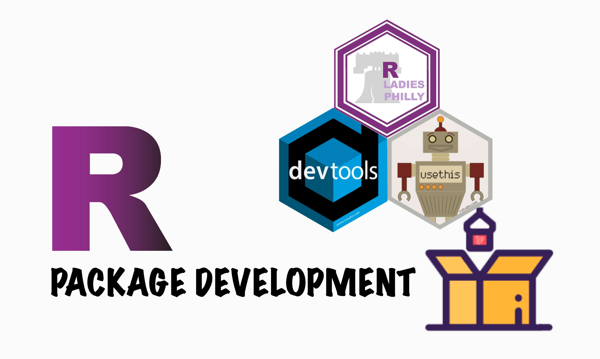

```{r setup, include=FALSE}
knitr::opts_chunk$set(echo = FALSE)
```

```{r echo=FALSE, fig.alt='Workshop flyer with hexes for R-Ladies Philly, devtools, and usethis dropping into an open pacakge.'}

```


```{r icon-links}
distilltools::icon_link(icon = "fas fa-pencil-alt",
          text = "materials",
          url = "https://www.pipinghotdata.com/posts/2020-10-25-your-first-r-package-in-1-hour/")
          
          
distilltools::icon_link(icon = "fas fa-play-circle",
          text = "video",
          url = "https://www.youtube.com/watch?v=xcXzaEmZ-m4&feature=youtu.be")

```

# Overview

A zoom workshop on introductory R package development for R-Ladies Philly.

# Abstract

This workshop is for people looking to learn how to make their own R packages and learn how to use `usethis` and `devtools` for package development. The workshop will cover handy one time functions (i.e., `usethis::create_package`) as well as functions used continuously throughout package development (i.e., `devtools::document`). At the end of the hour you should have a working, well-documented package with a single function, as well as a better understanding of the files and file structure required for R packages.

This workshop is suitable for beginner to intermediate R users. Attendees should be familiar with functions, but will not be writing their own function in this workshop. Familiarity with pipe or tidyverse is helpful.


