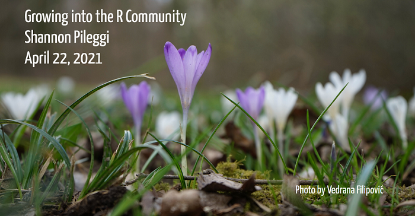

```{r setup, include=FALSE}
knitr::opts_chunk$set(echo = FALSE)
```

```{r echo=FALSE, fig.alt='Title slide with image of purple and white crocus flowers growing.'}

```


```{r icon-links}
distilltools::icon_link(icon = "images",
          text = "slides",
          url = "https://shannonpileggi.github.io/growing-into-r/#1")

distilltools::icon_link(icon = "fas fa-play-circle",
          text = "full meet-up recording",
          url = "https://www.youtube.com/watch?v=ozkJkiYxHGU")

distilltools::icon_link(icon = "fas fa-play-circle",
          text = "lightning talk",
          url = "https://www.youtube.com/watch?v=guzjt7xh2Cw")
```


### History

* April 22, 2021 R-Ladies Miami meet-up

* June 16, 2021 ⚡ abbreviated for an R-Ladies Philly lightning talk _Leveraging the R community for a job interview_

* September 15, 2021 R-Ladies Coventry & R-Ladies Utrecht joint meet-up

### Materials

<i class="fas fa-pencil-alt"></i> based on the blog post [A job interview presentation inspired by the R community:
How `#tidytuesday` and twitter helped me secure a job offer](https://www.pipinghotdata.com/posts/2020-08-30-a-job-interview-presentation-inspired-by-the-r-community/){target="_blank"}.

[<i class="fab fa-github"></i> repo](https://github.com/shannonpileggi/growing-into-r){target="_blank"} for slides

### Abstract

Starting something new in R can be daunting, but there are many community resources that can help! In this presentation, I’ll discuss how I crafted a job interview presentation by making modifications on publicly available TidyTuesday code. This built the technical and confidence-boosting scaffolding I needed for more open-ended projects. The success of this experience inspired me to transition from my role as a consumer and creator to contributor to give back to the R community, which has been incredibly fulfilling. Despite social distancing, I feel more connected to the R community than ever before!

