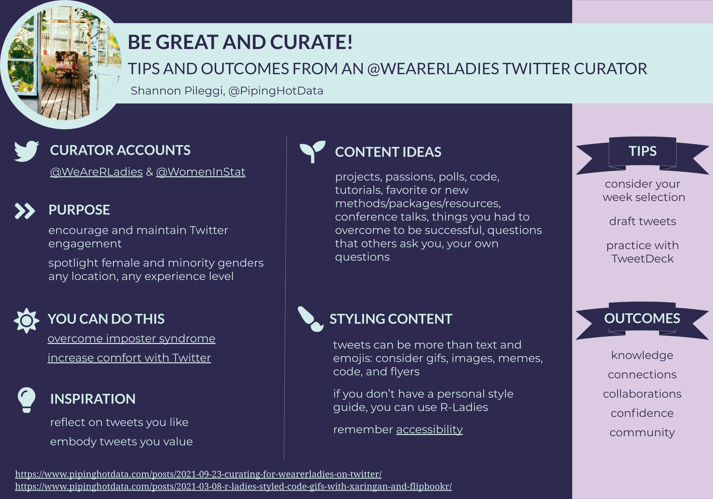

```{r setup, include=FALSE}
knitr::opts_chunk$set(echo = FALSE)
```

```{r echo=FALSE, fig.alt='Image of poster. Title bar in light blue, tips and outcomes side bar in light purple, main content on dark blue background.', fig.cap='Women in Statistics and Data Science poster presentation.'}

```


```{r icon-links}
distilltools::icon_link(icon = "fas fa-play-circle",
          text = "recording",
          url = "https://www.youtube.com/watch?v=SvnSakGZykk")

distilltools::icon_link(icon = "fas fa-file-pdf",
          text = "poster",
          url = "https://github.com/shannonpileggi/pipinghotdata_distill/blob/master/_talks/2021-10-07-be-great-and-curate/WDS-Curating.pdf")
```

### Overview

A poster presentation for the 2021 virtual Women in Statistics and Data Science conference.

### Abstract

The `@WomenInStat` (Women in Statistics and Data Science) and `@WeAreRLadies` (We are R-Ladies) rotating Twitter curator accounts promote visibility of women in our field and facilitates engagement with others. Serving as a rotating curator on a Twitter account with thousands of followers may seem daunting, but it is a great opportunity to share your knowledge, connect with others with similar interests, and learn something in return. In this talk, I’ll discuss how I planned ahead for my `@WeAreRLadies` curation week, what happened the week of, and the good things that followed.

### Acknowledgements

I am grateful to [Alison Hill](https://twitter.com/apreshill){target="_blank"}, [Ale Segura](https://twitter.com/alehsegura13){target="_blank"}, [Katherine Simeon](https://twitter.com/katherinemsd){target="_blank"}, and [Megan McClintock](https://www.linkedin.com/in/megan-mcclintock/){target="_blank"} 
for their feedback, at various stages, on this content! `r emo::ji("purple heart")`
