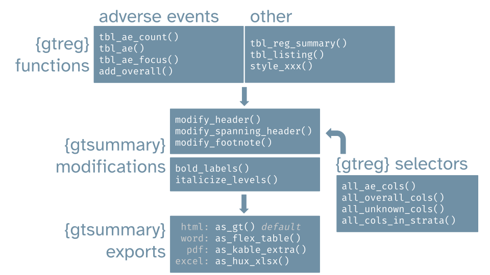

```{r thumbnail, eval=TRUE, echo=FALSE}
#| fig.cap: > 
#|   Overview of the {gtreg} package.
#| fig.alt: >
#|  A figure that groups various functions of the {gtreg} package
#|  in adverse event tables, other tables, modifications, and exporting.

```


See the package documentation at <https://shannonpileggi.github.io/gtreg/>.


# R in Pharma (2022) - 3 hour workshop

```{r, eval=TRUE, echo=FALSE}
distilltools::icon_link(icon = "images",
          text = "website",
          url = "https://shannonpileggi.github.io/gtreg-workshop-rinpharma-2022/")
```

<br>

# R in Pharma (2022) - 10 min talk

```{r, eval=TRUE, echo=FALSE}
distilltools::icon_link(icon = "images",
          text = "slides",
          url = "https://shannonpileggi.github.io/gtreg-talk-rinpharma-2022/#/title-slide")
```

<br>

# NHS-R (2022) - 15 min talk

```{r, eval=TRUE, echo=FALSE}
distilltools::icon_link(icon = "images",
          text = "slides",
          url = "https://shannonpileggi.github.io/gtreg-talk-nhsr-2022/#/title-slide")
```

<br>

# R in Medicine (2022) - 20 min talk

```{r, eval=TRUE, echo=FALSE}
distilltools::icon_link(icon = "images",
          text = "slides",
          url = "https://shannonpileggi.github.io/introducing-gtreg-rmed-2022/#/title-slide")
```


```{r, eval=TRUE, echo=FALSE}
distilltools::icon_link(icon = "fas fa-play-circle",
          text = "recording",
          url = "https://youtu.be/DmslEfczYqM")

```


