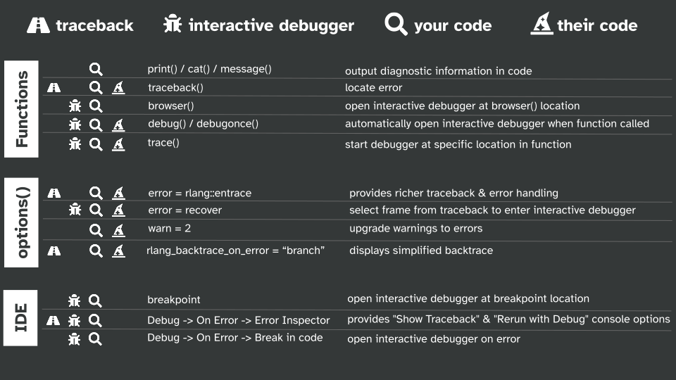

```{r thumbnail, eval=TRUE, echo=FALSE}
#| fig.cap: > 
#|   Overview of debugging tools in R.
#| fig.alt: >
#|  Figure organize by functions, options, and the RStudio IDE, with icons
#|  to indicate traceback, interactive debugger, your code, their code.

```


```{r icon-links, eval=TRUE, echo=FALSE}
distilltools::icon_link(icon = "images",
          text = "slides",
          url = "https://shannonpileggi.github.io/debugging-nhsr/#/title-slide")
```


# Overview

A 3-hour zoom workshop on debugging for the NHS-R conference.

Under the [Creative Commons Share Alike 4.0 International license](https://creativecommons.org/licenses/by-sa/4.0/), workshop materials have been adapted from the [2022 RStudio What They Forgot To Teach You About R](https://rstats-wtf.github.io/wtf-2022-rsc/) Workshop.

# Pre-requisites

Knowledge of how to write a function in R.

# Learning objectives:

* Review code troubleshooting tips.

* Discuss debugging functions (`traceback()`, `browser()`, `debug()`, `trace()`, and `recover()`) and the additional benefits of employing some of these strategies within RStudio.

* Distinguish between strategies for debugging your own code versus someone else’s code.