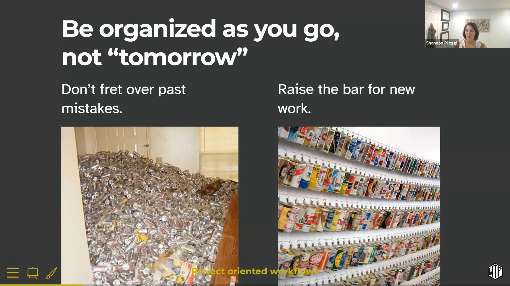

```{r thumbnail, eval=TRUE, echo=FALSE}
#| fig.cap: > 
#|   Overview of debugging tools in R.
#| fig.alt: >
#|  Figure organize by functions, options, and the RStudio IDE, with icons
#|  to indicate traceback, interactive debugger, your code, their code.

```


```{r icon-links, eval=TRUE, echo=FALSE}
distilltools::icon_link(icon = "images",
          text = "slides",
          url = "https://rstats-wtf.github.io/wtf-project-oriented-workflow-slides/#/title-slide")
```


# Overview

A 2-hour zoom workshop on Project Oriented Workflows for R-Ladies St. Louis.

Under the [Creative Commons Share Alike 4.0 International license](https://creativecommons.org/licenses/by-sa/4.0/), workshop materials have been adapted from the [2022 RStudio What They Forgot To Teach You About R](https://rstats-wtf.github.io/wtf-2022-rsc/) Workshop.


# Learning objectives:

* Establish the concept of the project as the basic organizational unit of work. RStudio offers rich support for this way of working via **P**rojects.

* Describe benefits of project oriented workflows.

* Apply best practices for working in RStudio projects, including

  - Creating robust file paths that travel well in time and space (someone else's computer, your computer a year from now) with base R and with the {here} and {fs} packages.

  - Constructing human and machine readable file names that sort nicely.

  - Differentiating workflow elements, analysis inputs, and analysis outputs in project structure to create navigable programming interfaces.

  - Restarting R frequently, with a blank slate.