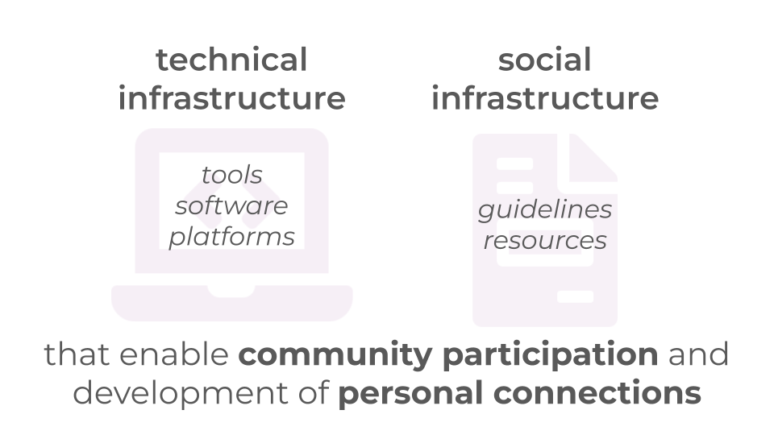

```{r thumbnail, eval=TRUE, echo=FALSE}
#| fig.cap: > 
#|   Screenshot of slide discussing the importance of both technical and social
#|   infrastructure.
#| fig.alt: >
#|  left hand side: technical infrastructure: tools, software, platforms
#|  right hand side: social infrastructure: guidelines, resources
#|  underneath: that enable community participation and development of personal connections

```


```{r, eval=TRUE, echo=FALSE}
distilltools::icon_link(icon = "images",
          text = "useR slides",
          url = "https://github.com/rladies/rladies_global_presentations/blob/master/20240813_positconf/2024_useR.pdf")

distilltools::icon_link(icon = "images",
          text = "posit::conf slides",
          url = "https://github.com/rladies/rladies_global_presentations/blob/master/20240813_positconf/posit_conf2024.pdf")
```

# Conferences

* useR 2024 | Salzburg, Austria | 2024-07-10

* posit::conf(2024) | Seattle, Washington (USA) | 2024-08-14

# Abstract

As a global non-profit established in 2016, R-Ladies has more than 100k members from 233 chapters in 63 countries to support the mission of increasing gender diversity in the R community. Empowering local chapters is challenging as accessibility and awareness of communication methods, software choices, social platforms, and support avenues varies internationally. Join us for insights into our journey of developing a global technical and social infrastructure while fostering collaboration and growth and granting chapters the freedom to tailor their activities to local contexts. Walk away with practical technical and social strategies to empower and diversify your own data science communities based on learning from continuous feedback.
