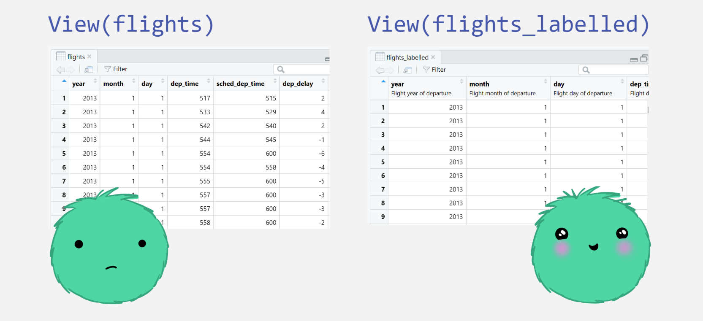

```{r thumbnail, eval=TRUE, echo=FALSE}
#| fig.cap: > 
#|   Screenshot of slide 24 showing the difference between viewing labelled
#|   and unlabelled data.
#| fig.alt: >
#|  Left hand side shows table of unlabelled data that has variable names only
#|  in the table header, overlayed with a sad monster face. 
#|  Right hand side shows table of labelled data that has variable names and variable
#|  labels in the table header, overlayed with a happy monster face.

```


```{r, eval=TRUE, echo=FALSE}
distilltools::icon_link(icon = "images",
          text = "slides",
          url = "https://shannonpileggi.github.io/context-is-king/#/title-slide")
```


# Abstract

The quality of data science insights is predicated on the practitioner’s understanding of the data. Data documentation is the key to unlocking this understanding; with minimal effort, this documentation can be natively embedded in R data frames via variable labels. Variable labels seamlessly provide valuable data context that reduces human error, fosters collaboration, and ultimately elevates the overall data analysis experience. As an avid, daily user of variable labels, I am excited to help you discover new workflows to create and leverage variable labels in R!
