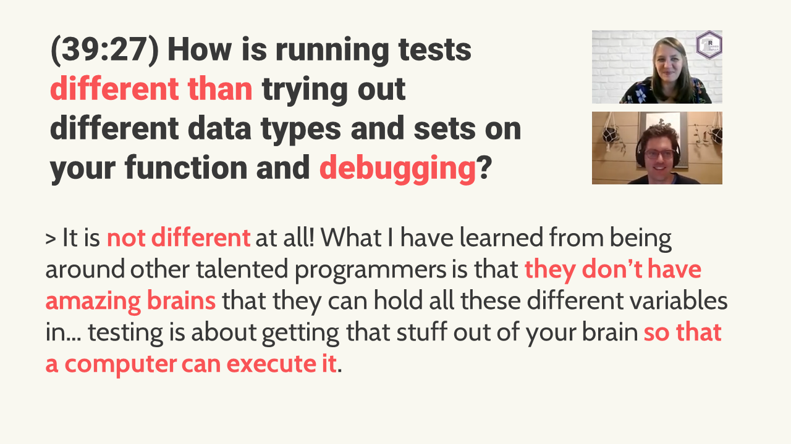

```{r thumbnail, eval=TRUE, echo=FALSE}
#| fig.cap: > 
#|   Question and answer, paraphrased, from the workshop.
#| fig.alt: >
#|   Question: (39:27) How is running tests different than trying out different data types and sets on your function and debugging?
#|   Answer: It is not different at all! What I have learned from being around other talented programmers is that they don’t have amazing brains that they can hold all these different variables in… testing is about getting that stuff out of your brain so that a computer can execute it.

```

```{r icon-links, eval=TRUE, echo=FALSE}
distilltools::icon_link(icon = "fas fa-pencil-alt",
          text = "blog post",
          url = "https://www.pipinghotdata.com/posts/2021-11-23-getting-started-with-unit-testing-in-r/")
          
          
distilltools::icon_link(icon = "fas fa-play-circle",
          text = "recording",
          url = "https://youtu.be/4bPekjzIYiU")

```

# Overview

A zoom workshop on unit testing for R-Ladies Philly.

# Abstract

In this workshop, Shannon Pileggi and [Gordon Shotwell](https://twitter.com/gshotwell){target="_blank"} discuss how to get started 
with unit testing in R, which is formal automated testing of functions within 
packages. We demonstrate handy functions in `usethis` and `devtools`, strategies
for writing tests, debugging techniques, and broad concepts in function writing 
that facilitate a smoother testing process.

This workshop picks up exactly where we left our little `ralph` 
(aka **R**-**L**adies **Ph**illy) package one year ago with 
[“Your first R package in 1 hour: Tools that make R package development easy”](https://www.pipinghotdata.com/posts/2020-10-25-your-first-r-package-in-1-hour/){target="_blank"}. Participants will get the most out of this workshop if they review those materials
in advance, or if they are already familiar with building R packages with `devtools` 
and `usethis`.
