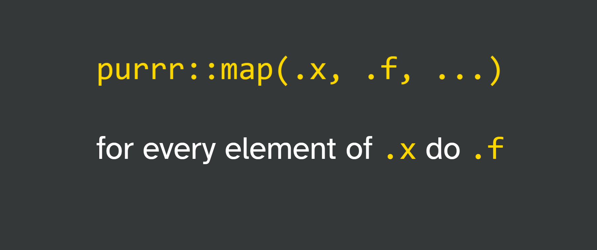

```{r thumbnail, eval=TRUE, echo=FALSE}
#| fig.cap: > 
#|   Slide from the workshop.
#| fig.alt: >
#|  on gray background:
#|  purrr::map(.x, .f, ...)
#|  for every element of .x do .f

```


```{r icon-links, eval=TRUE, echo=FALSE}
distilltools::icon_link(icon = "images",
          text = "slides",
          url = "https://shannonpileggi.github.io/iterating-well-with-purrr/#/title-slide")
```


```{r icon-links-2, eval=TRUE, echo=FALSE}
distilltools::icon_link(icon = "fas fa-play-circle",
          text = "recording",
          url = "https://youtu.be/Uul_Hpih9dM")

```

# Overview

A zoom workshop on iterating well with purrr for R-Ladies Rabat.

Under the [Creative Commons Share Alike 4.0 International license](https://creativecommons.org/licenses/by-sa/4.0/), workshop materials have been adapted from the [2020 RStudio What They Forgot To Teach You About R](https://rstats-wtf.github.io/wtf-2020-rsc/) Workshop.

# Abstract

In this workshop we discuss approaches to iteration in R. We briefly discuss iterative techniques that do not require loops or `purrr::map_` (for example, group_by, vectorized functions, etc.). Then we explore lists as an object to store information of varying types and sizes and explain how to extract elements from a list via the `purrr::map_` family.
