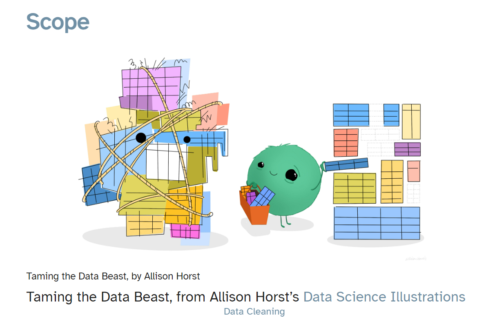

```{r thumbnail, eval=TRUE, echo=FALSE}
#| fig.alt: >
#|  Screenshot of slide featuring artwork by Allison Horst named Taming the Data 
#|  Beast. The artwork shows messy grid like sheets roped together on the left hand side,
#|  with a frazzled looking monster inserting grid sheets into a more orderly
#|  fashon on right hand side.

```


```{r icon-links, eval=TRUE, echo=FALSE}
distilltools::icon_link(icon = "images",
          text = "website",
          url = "https://shannonpileggi.github.io/rmedicine-data-cleaning-2023/")
```

```{r icon-links-2, eval=TRUE, echo=FALSE}
distilltools::icon_link(icon = "fas fa-play-circle",
          text = "recording",
          url = "https://www.youtube.com/watch?v=6wFYAMwYzM4")

```


# Overview

In this workshop you will learn how to import messy data from an Excel
spreadsheet, and develop the R skills to turn this mess into tidy data
ready for analysis.

## Learning objectives

-   The acquire a foundational understanding of how data should be organized.

-   To import Excel files with (common, messy) data problems.

-   To address and clean common messy data problems in each variable.

-   To address and clean data with more complex meta-problems, like pivoting to long format for data analysis, thickening timestamped data to manageable time units, padding missing dates, and joining different datasets together.

## Is this course for me?

If your answer to any of the following questions is "yes", then this is
the right workshop for you.

-   Do you frequently receive untidy data for analysis in Excel
    spreadsheets?

-   Does this drive you slightly batty?

-   Do you want to learn how to make your life easier with a suite of
    data cleaning tools?

The workshop is designed for those with some experience in R. It will be
assumed that participants can perform basic data manipulation.
Experience with the {tidyverse} and the `%>%`/`|>` operator is a major plus,
but is not required.

# Co-Instructors

[**Crystal Lewis**](https://cghlewis.com) (she/her) is a Freelance Research Data Management Consultant, helping people better understand how to organize, document, and share their data. She has been wrangling data in the field of Education for over 10 years. She is also a co-organizer for R-Ladies St. Louis.

[**Peter Higgins**](https://bookdown.org/pdr_higgins/rmrwr/) (he/him) is
a Professor at the University of Michigan, a translational researcher
interested in reproducible research, and the creator of the
{medicaldata} package. He enjoys clean and tidy data when he (rarely)
encounters it in the wild.
